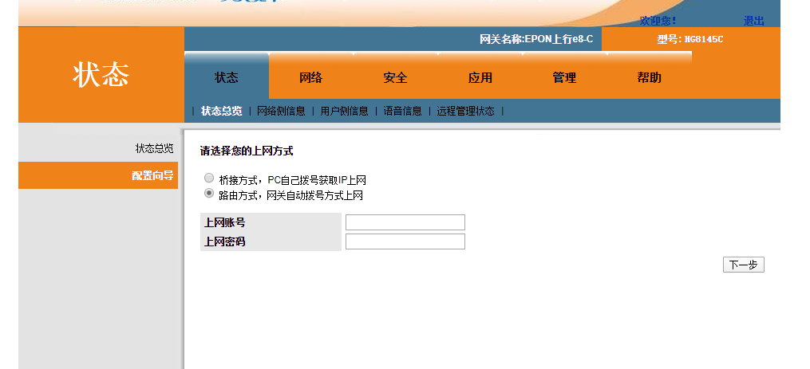
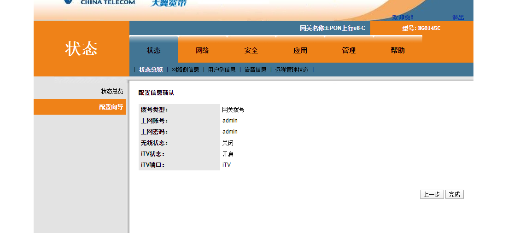
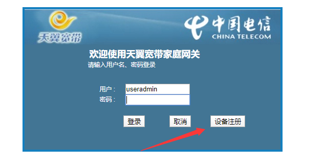
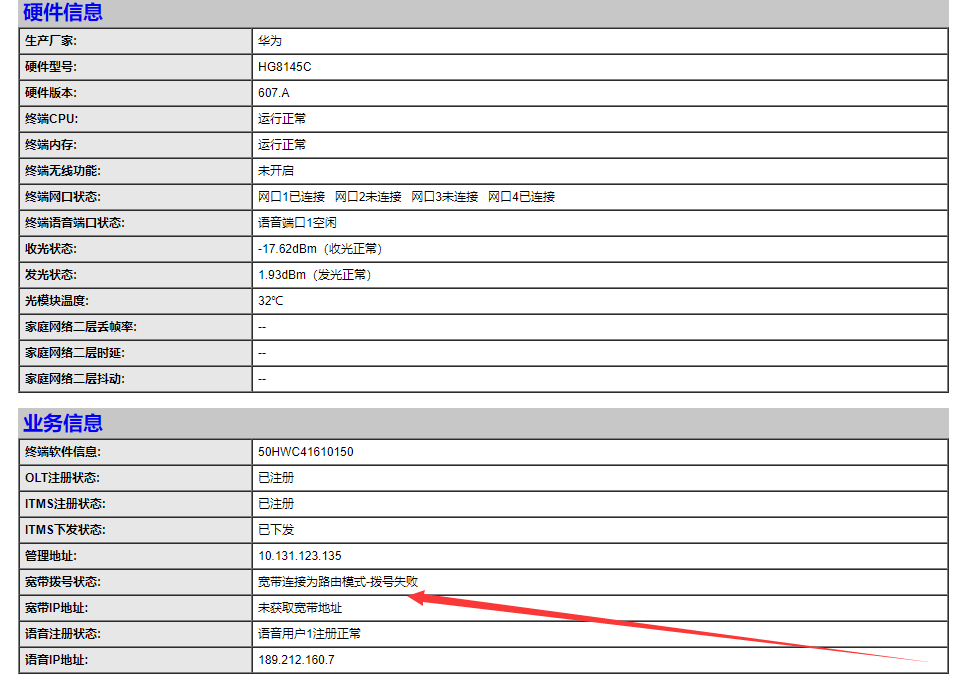

断网攻击

此章记述：我玩了家里的路由器后`192.168.1.1(网关)`，导致无法上网的问题

通过下面图片中一步一步，进行引导，我

通过这一步之后，我发现我怎么都上不了网了。（ps.我最初的想法是再配置一个wifi）

后面思考了很多办法，停用wifi，重启路由器，初始化路由器，都没有用。

知道我注意到了这个

进去后

点击自检，返回的结果如下

> 注意失败的这两行

然后我猜测，既然是拨号，那么多半都会有密码。但是我并不知道密码什么的，那么有可能图一中的上网账号和上网密码，就是拿来拨号用的。

那么我便想办法弄到账号密码。

然后试了很多办法，最后终于找到了账号和密码。

并且通过此账号和密码，成功重新的设置了配置信息。然后连上了网

密码是通过打电话`1000`要来的。通过我老妈手机绑定的宽带，查到了宽带账号和密码。成功连上了网。

