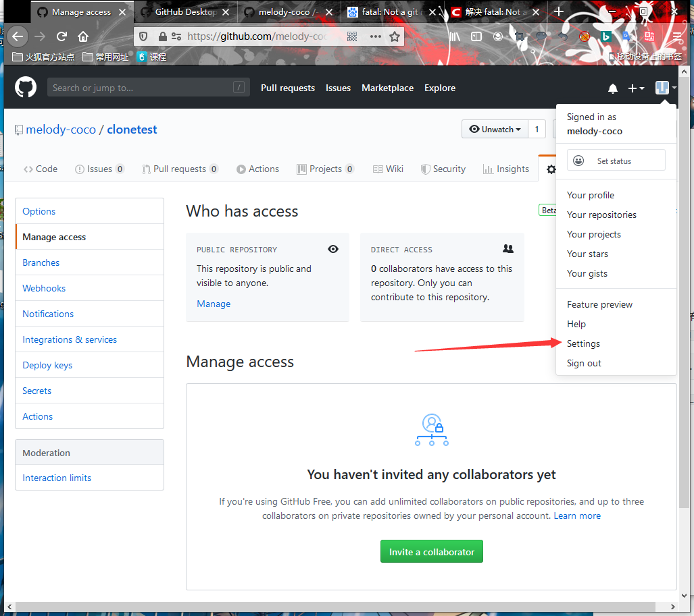
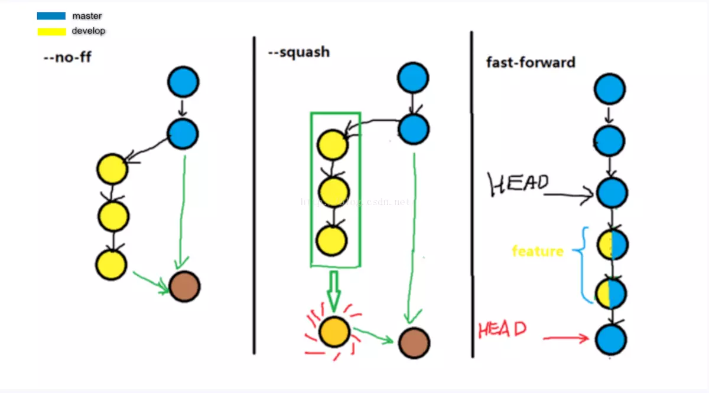

<center>Git概念</center>
> 最基本的创建版本库在`Git简介里`


### 一.	时光穿梭


#### 1.	版本回退

​	Git最大的作用之一，版本回退。当我们修改过程中，不小心改错了文件，使用此方法可以简单的进行版本的回退，就像是`IDEA`的`Ctrl + Z`，和`Linux`的快照功能的一样。


使用`git log`可以查看提交的历史记录，如下：

```
[root@localhost ~]# git log
commit 8adb7c830c118ebd2ee45a62ef26382eae6e6c27(HEAD -> master)
Author: melody <1154717286@qq.com>
Date:   Sun Feb 16 19:59:25 2020 +0800

    第一次测试git status

commit 33689022d668b5bfe2380ef10924bfa2c90b6018
Author: melody <1154717286@qq.com>
Date:   Sun Feb 16 18:40:23 2020 +0800

    这是新建a文件后的第一次修改

commit 07b9689e1b34d56b6e0304722d974fe7c9118adb
Author: melody <1154717286@qq.com>
Date:   Sun Feb 16 18:32:54 2020 +0800

    melody的第一次git文件提交
```

其中字段的详细信息如下

+ `commit`：`commit id(版本号)`，
+ `Author`：关于提交的用户信息。`name`，`mail`
+ `Date`：日期
+ `git commit -m ""`写入的描述性文字

> 上面`HEAD`指向的版本就是当前版本。
>
> 回退的话：上一版本就表示为`HEAD^`，上上个版本表示为`HEAD^^`。
>
> 上100个版本就显示为`HEAD~100`。历史版本信息，除了这种方法外还能使用版本号的方式显示


  现在以及知道了所有的版本历史信息，我们使用`git reset --hard HEAD^ `回退到上个版本

```
[root@localhost ~]# git reset --hard HEAD^			//使用此命令回退到上个版本

[root@localhost ~]# git reset --hard 33689022d668b5bfe	//使用版本号也能回退，版本号不必写全，也不能就只写两位
```


​	现在已经回退到了上一个版本。但此时查看`git log`的话，却会发现没有最新的版本信息了：

``` 
[root@localhost ~]# git log
commit 33689022d668b5bfe2380ef10924bfa2c90b6018 (HEAD -> master)
Author: melody <1154717286@qq.com>
Date:   Sun Feb 16 18:40:23 2020 +0800

    这是新建a文件后的第一次修改

commit 07b9689e1b34d56b6e0304722d974fe7c9118adb
Author: melody <1154717286@qq.com>
Date:   Sun Feb 16 18:32:54 2020 +0800

    melody的第一次git文件提交

```


如果上面的命令终端没关掉的话，只要知道其版本号的话，就能指定回到未来的某个版本

```
[root@localhost ~]# git reset --hard 8adb7c830c				//回退到最新版本
```


如果已经关掉命令行终端的话，则使用`git reflog`：

```
[root@localhost ~]# git reflog			
3368902 HEAD@{0}: reset: moving to 33689022d668b5bfe
8adb7c8 HEAD@{1}: reset: moving to 8adb7c8
3368902 HEAD@{2}: reset: moving to HEAD^
8adb7c8 HEAD@{3}: commit: 第一次测试git status
3368902 HEAD@{4}: commit: 这是新建a文件后的第一次修改
07b9689 HEAD@{5}: commit (initial): melody的第一次git文件提交
```

> 使用此命令可以查询到所有的，版本信息


#### 2.	工作区与暂存区

> Git和其他版本控制系统如SVN的一个不同之处就是有暂存区的概念。


**工作区（Working Directory）**

就是在电脑里能看到的目录，比如我的`learngit`文件夹就是一个工作区：


**版本库（Repository）**

工作区有一个隐藏目录`.git`，这个不算工作区，而是Git的版本库。

Git的版本库里存了很多东西，其中最重要的就是称为stage（或者叫index）的暂存区，还有Git为我们自动创建的第一个分支`master`，以及指向`master`的一个指针叫`HEAD`。


第一步是用`git add`把文件添加进去，实际上就是把文件修改添加到暂存区；

> 此处修改文件`readme.txt`和新建文件`LICENSE` 并添加到暂存区


第二步是用`git commit`提交更改，实际上就是把暂存区的所有内容提交到当前分支。


因为我们创建Git版本库时，Git自动为我们创建了唯一一个`master`分支，所以，现在，`git commit`就是往`master`分支上提交更改。

你可以简单理解为，需要提交的文件修改通通放到暂存区，然后，一次性提交暂存区的所有修改。

不过对一个文件`a`，修改第一次然后添加到暂存区，然后继续修改第二次不添加到暂存区。接着直接`commit`，这样的话，第二次修改的内容是不会上传到版本库的。

如有不懂[点击](https://www.liaoxuefeng.com/wiki/896043488029600/897271968352576)


#### 3.	管理修改

> Git比其他版本控制系统设计得优秀，因为Git跟踪并管理的是修改，而非文件。

很简单的一个问题，如果我们对一个文件`a`，先进行一次修改并且会使用`git add a`添加暂存区。然后进行第二次修改，第二次修改并不添加到暂存区。然后使用`git commit`进行提交。这时候使用`git status`查看会看到第二次修改并没有提交上去。


实验如下：

```
[root@localhost ~]# cat a
this is 1											//先查看a文件的内容
[root@localhost ~]# vim a 							//进行第一次修改
this is 1	
this is 2
[root@localhsot ~]# git add a						//把第一次修改提交到暂存区
[root@localhost ~]# vim a							//进行第二次修改
this is 1
this is 2
this is 3
[root@localhost ~]# git commit -m "测试"			//提交暂存区中的修改到maste brach
1 file changed, 1 insertion(+)
[root@localhhost ~]# git status 				//使用git status命令查看修改信息
On branch master
Changes not staged for commit:
  (use "git add <file>..." to update what will be committed)
  (use "git checkout -- <file>..." to discard changes in working directory)
	modified:   a

no changes added to commit (use "git add" and/or "git commit -a")
```

> 上文中可以看到的是，第二次修改并没有成功提交，也就是说第二次修改在版本库没有生效。
>
> 如果`Git`管理的是文件的话，那么两次都会生效的，而不是第二次修改未生效。

我们回顾一下操作过程：

第一次修改 -> `git add` -> 第二次修改 -> `git commit`


提交后，用`git diff HEAD -- readme.txt`命令可以查看工作区和版本库里面最新版本的区别：

```
diff --git a/a b/a
index c781b26..239e841 100644
--- a/a
+++ b/a
@@ -1,2 +1,3 @@
 this is 1
 this is 2
+this is 3
```

> 可以看到，工作区的`a`比版本库的`a`多了一行


#### 4.	撤销修改

> 当很多时候我们改错了文件，如果提交上去的话可能会初始。这时候就需要用到撤销修改


两种撤销的命令：

+ `git checkout -- 文件名`：撤销对文件的修改。ps.适用于修改还没有提交到暂存区。
+ `git reset HEAD <文件名>`：撤销对文件的修改。ps.适用于修改已经存在与暂存区


实例1：

> 使用`git checkout -- a`命令进行撤销对文件a的修改

```
[root@localhost ~]# cat a			//查看文件a
this is 1
[root@localhost ~]# vim a			//修改文件a
this is 1
this is 2
[root@localhost ~]# git status	//查看当前状态，可以看到当前a文件，修改了但未提交至暂存区
On branch master		
Changes not staged for commit:			
  (use "git add <file>..." to update what will be committed)	
  (use "git checkout -- <file>..." to discard changes in working directory)
												
	modified:   a						

no changes added to commit (use "git add" and/or "git commit -a")

[root@localhost ~]# git checkout -- a		//取消对文件a的修改
[root@localhost ~]# cat a					//查看文件a
this is 1
```

> `git checkout`其实是用版本库里的版本替换工作区的版本，无论工作区是修改还是删除，都可以“一键还原”。


实例2：

> 使用`git reset HEAD a`命令来撤销暂存区中，文件a的修改

```
[root@localhost ~]# cat a			//查看文件a
this is 1
[root@localhost ~]# vim a			//修改文件a
this is 1
this is 2
[root@localhost ~]# git add a		//添加文件a到暂存区
[root@localhost ~]# git status 		//查看状态
On branch master
Changes to be committed:
  (use "git reset HEAD <file>..." to unstage)		//提示使用git reset 命令取消提交

	modified:   a			//可以看到文件a已经在暂存区中
	
[root@localhost ~]# git reset HEAD a	//把文件a从暂存区移除
[root@localhost ~]# git status			//查看状态
On branch master
nothing to commit, working tree clean
```


#### 5.	删除文件

> 在Git中，删除也是一个修改操作

我们工作区有一个文件`a`，并且我们通过`git add a`,` git commit -m "a"`已经提交文件`a`到版本库中，可是我们本地工作区删除了文件`a`的话，这也是一次修改操作，仍然需要提交修改到版本库中，版本库才会删除文件`a`。


提交删除命令为：`git rm 文件名`


实验过程如下：

```
[root@localhost ~]# ls 									//查看工作区文件
a
[root@localhost ~]# rm a								//删除工作区文件a
[root@localhost ~]# git status							//查看当前状态
On branch master
Changes not staged for commit:
  (use "git add/rm <file>..." to update what will be committed)
  (use "git checkout -- <file>..." to discard changes in working directory)

	deleted:    a										//可以看到当前状态是，删除文件a。
															//但是还没有提交到暂存区
no changes added to commit (use "git add" and/or "git commit -a")
```


在此我们已经在工作区中，删除了文件`a`，此时我们有两种选择：

1.版本库中也删除文件`a`

```
[root@localhost ~]# git rm a							//提交删除文件a，到暂存区
rm 'a'
[root@localhost ~]# git commit -m "删除文件a"			//提交删除的修改操作到版本库
	//此时版本库中已经删除了，文件a
```


2.从版本库中恢复文件`a`

```
[root@localhost ~]# git checkout -- a
```

> `git checkout`其实是用版本库里的版本替换工作区的版本，无论工作区是修改还是删除，都可以“一键还原”。


### 二.	远程仓库

> Git是分布式版本控制系统，同一个Git仓库，可以分布到不同的机器上。怎么分布呢？最早，肯定只有一台机器有一个原始版本库，此后，别的机器可以“克隆”这个原始版本库，而且每台机器的版本库其实都是一样的，并没有主次之分。


也就是说本地有`工作区,暂存区，master brach`，而最重要的是远程库。

想使用远程库有两种方法：1.自己搭建一台运行Git的服务器。2.通过GitHub网站来使用远程库

> 此处不讲搭建Git服务器，只讲使用GitHub


#### 1.	配置`SSH KEY`

接下来开始讲解：`GitHub`本地和远程库的`SSH`公钥配置

1. 注册GitHub账号。

> 这一步就不说了，自己创建


2. 创建`SSH KEY`，在用户家目录下查看有没有`.ssh`目录，再看看目录下有没有`id_rsa`和`id_rsa.pub`，如果有了的话直接跳到下一步。没有的话，打开`Shell`主目录，创建`SSH KEY`：

   ```
   [root@localhost ~]# ssh-keygen -t rsa -C "1154717286@qq.com"   //此处为你GitHub邮箱
   ```

   > 运行了以上命令的话，家目录下的`.ssh`目录，就有了`id_rsa`和`id_rsa.pub`文件。前者为私钥后者为公钥。


3. 登录GitHub，找到`Setting`中的`SSh KEY`页面，并且把本地主机家目录中的`id_rsa.pub`文件中的内容粘贴上去并自定义名称提交




> 这样就配置好了`GitHub`中，本地库连接远程库中的`SSH`公钥，这样我们本地就可以连接远程库了


#### 2.	添加远程库

> 首先我们在GitHub中创建了一个库`githubtest`(创建过程就不写了)


使用以下命令关联本地库和远程库(在本地`Git`工作目录下)：

```
[root@localhost ~]# git remote add origin git@github.com:melody-coco/githubtest
						    远程库名               	GitHub用户名	远程项目名
```

> 添加后，远程库的名字就是`origin`，这是Git默认的叫法，也可以改成别的，但是`origin`这个名字一看就知道是远程库。


关联了本地版本库和远程库后，接下来只需要`git push`就可以把本地版本库的数据提交到远程库中了

```
[root@localhost ~]# git push -u origin master
```

`-u`只有在第一次上传的时候才用，往后的话可以省略。

> `origin`是上面关联本地库远程库时定义的库名。`master`是分支，此处为`master`主分支。

> ps.注意此命令可能用不了，因为可能你GitHub创建项目的时候勾选了创建`README`，这样远程库就比版本库中多了一个README。如此便需要使用`git pull origin master`，先把远程库同步到版本库中


#### 3.	从远程库克隆

> 上面是现有本地库，再有远程库。(准确说并不是谁先有，而是把两个创好的库关联起来)


其实从零开始开发的话。最好的方式是先：创建远程库，再创建本地库。(准确说是把远程库克隆到本地库中)

使用此方式可以直接跳过添加远程库的步骤


远程克隆的命令如下：

```
[root@localhhost ~]# git clone git@github.com:melody-coco/clonetest.git
```

> 此命令会把`melody-coco`用户下的`clonetest`项目，克隆到当前所在目录下的新建`clonetest`目录中


克隆后也不用再`git init`。因为克隆来的项目本身就是版本库


克隆命令和`git pull 远程库名 分支名`命令和区别为：

+ 克隆命令：可以不初始化版本库。从远程服务器克隆一个一模一样的版本库到本地,复制的是整个版本库
+ `git push`：获取远程库的最新版到本地版本库，需要初始化版本库，也需要添加远程库才能使用。


### 三.	分支管理

> 分支的具体概念就不说了有需要自己看。[点击](https://www.liaoxuefeng.com/wiki/896043488029600/900003767775424)

> 注意：分支其实也只是指针


#### 1.	分支的概念

这是master分支，注意`HEAD`只是指向当前分支的指针。你当前在操作那个分支他就指向哪个分支


创建dev分支，此时我在操作dev分支，所以`HEAD`就指向dev。注意此处的dev和master指向的都是同一块可是dev分支的都和操作都不会管master的事。


此处我们修改了一下dev分支中的一个文件。(ps.注意这时候我们修改master分支的话，dev不会跟着改变)


当然我们如果修改了dev分支的文件的话，再切换到master分支去看，是没有dev修改的数据出现的。也就是说dev分支的操作与master分支无关：


接下来合并master分支和dev分支：


然后，我们删除了dev分支(也就是删除了dev指针后)。就变成接下来这样：


> 以上就是简单概念，如果详细的话[点击](https://www.liaoxuefeng.com/wiki/896043488029600/900003767775424)


> 注意：对分支的操作仍然要`git add`，再`git commit`后才能正确的建立分支的文件。


#### 2.	分支管理操作

创建分支的命令：

```
$ git checkout -b dev				//创建dev分支，并切换到dev分支
```

> 其实这条命令就相当于：`git branch dev`创建分支，`git checkout dev`切换到dev分支。


切换分支：

```
$ git checkout dev					//切换到dev分支
```


查看当前分支：

```
$ git branch
```


合并分支：

```
$ git merge dev							//合并dev分支到当前分支上
```


删除分支：

```
$ git branch -d dev					//删除dev分支
```


也可以使用`switch`来切换分支：

创建并切换到新的`dev`分支，可以使用：

```
$ git switch -c dev
```

直接切换到已有的`master`分支，可以使用：

```
$ git switch master
```


以下是我自己测试出来的：

> 关于Git版本控制器的分支测试如下：
>
> 1.	新的分支不能往老的分支合并。(新老都不是主分支，新分支由老分支而来)
> 2.	主分支发生变化，基于主分支的其他分支不会发生变化。猜想这时的主分支相对来说较新，是否较新的分支不能合并较老的分支
> 3.	主分支发生变化后，基于主分支的其他其他分支不会发生变化。但是把主分支和新分支合并的话。主分支的所有修改过的内容，和新分支所有修改或新添加的内容都会合并
> 4.	主分支直接新建两个分支，然后两个分支在同文件的同位置插入不同的文本。然后主分支能合并到其中一分支上，但再合并到领一分支上的时候会报错。
> 5.	主分支新建一个分支1，修改文本a加入一句话。然后再新建分支2。分支2基于分支1。然后主分支能直接合并分支2，但此时再合并分支1的话就不行，会报错：已经是最新版本了
> 6.	主分支直接新建两个分支，然后两个分支同文件的不同位置刚好隔开，插入不同的文本。然后主分支合并到其中一分支上，但再合并到另已分支上时，还是会报错。
> 7.	主分支直接新建两个分支，然后两个分支不同文件的同位置，插入不同的文本。然后主分支合并到其中一分支上，然后再插入到另一分支上都不会报错
>    注意，使用git branch命令可以看到当前在哪个分支中。在哪个分支中创建新的分支，则新分支是此分支的子分支
>
> 总的来说遵循两个原则：
> 1.主分支创建了一个父分支，父分支再创建一个子分支。主分支和子分支合并后，不能再合并父分支。系统会提示已经是最新版本了
> 2.主分支创建了两个分支1，2。如果1，2分支修改相同的文件。则如果主分支要和1，2分支都合并的话就会产生冲突


#### 3.	解决冲突

> 上面测试了七个问题。以至于测试出来了两个原则，原则1就不说了：主分支已经合并了更新的分支，就不能再合并旧的分支。

但是教程上有一个问题，如果我。在主分支中新创了一个分支`dev`，然后修改`dev`中的数据。这时候`dev`就是最新的了对吧。但是如果这时候我`master`分支也修改了文件，并且此文件就是`dev`分支中修改的文件。这时候我再把`dev`和`master`合并的话，就会产生**冲突**。

> 其实这个问题，和我上面部分第二原则是一样的。


接下来就演示这个原则过程：


​	1.创建并切换到新的`dev`分支

```
$ git checkout -b dev
```


​	2.修改分支中的a文件

```
[root@localhost ~]# vim a
this is 1
this is dev 1
```

> `git add`和`git commit`就不写了


​	2.切回到`master`分支，并且修改a文件

```
$ git checkout master
[root@localhost ~]# vim a
this is 1
this is master 1
```

> `git add`和`git commit`就不写了


	3.	合并分支

```
$ git merge dev				//合并dev分支
Auto-merging a						//自动合并 a
CONFLICT (content): Merge conflict in a	冲突（内容）：合并冲突于 a
Automatic merge failed; fix conflicts and then commit the result.

$ git status 						//查看此时的状态
On branch master
Your branch is ahead of 'origin/master' by 2 commits.
  (use "git push" to publish your local commits)

You have unmerged paths.				//你有未合并的分支
  (fix conflicts and run "git commit")
  (use "git merge --abort" to abort the merge)

Unmerged paths:							//分支路径
  (use "git add <file>..." to mark resolution)

	both modified:   a					//双方修改

no changes added to commit (use "git add" and/or "git commit -a")
```


4. 此时查看a的内容

   ```
   [root@localhost ~]# cat a
   <<<<<<< HEAD
   this is master 1
   =======
   this is dev 1
   >>>>>>> dev
   ```

   > Git用`<<<<<<<`，`=======`，`>>>>>>>`标记出不同分支的内容，

   

   此时的情况如同下图：

   

   

   5.我们修改a后保存，并提交修改。最后删除分支`dev`

   ```
   [root@localhost ~]# vim a
   this is 1
   this is master and dev 1
   
   $git add a
   $ git commit -m "成功解决冲突"
   $ git branch -d dev					//删除dev分支
   ```

   


> ps .其实使用`git log`可以看到分支的合并情况


#### 4.	git merge --no-ff

> 原本这个标签应该叫“分支管理策略”。但是我觉得不形象。

上面的分支管理中可能说过。分支管理的话默认使用的是`Fast-gorward`模式(快进)。这种模式有什么好处喃


之前讲分支写分支概念的时候说过：`HEAD`是一个指针。其实分支`master`也是一个指针，所以Git合并分支的速度很快，这就是因为操作的是指针而不是文本。

​	当我们创建了`dev`分支，进行了操作后，然后把他合并到`master`分支上时。其实是把`master`的指针指向`dev`指针指向的位置。如下图：


但是有一个问题，如果我们`master`分支要使用`git reset --hard`回退的话。这种情况下，如果使用了`Fast-forward`模式的话。回退就会回退到`dev`分支的`commit`提交信息中，而不是master分支的提交信息。


​	如下图：



> 上图`3`。中就是fast-forward模式的情况。主分支和`dev`支使用`fast-forward`合并了后。主分支回退的话，会回退到`dev`的`commit`中。


而图`1`.中就是`git merge --no-ff branch名`。也就是强制不使用`Fast-forward`模式

如果不使用`Fast-forward`模式的话。回退则会退回到和`dev`分支合并前的版本。


> 强烈建立使用`git merge --no-ff`合并，而不是`merge`合并。

`--no-ff`参数的话。对于主分支十分有用。一般我们主分支都是发布的正式版本。主分支不是开发用的，而是发布用的，一般开发的话，另开一个分支，基于这个分支进行开发


#### 5.	git stash

> 此章本来应该是BUG分支。但还是不形象

想象这样一个工作场景：

​	我本来正在`dev`分支开发东西。但是突然听说`master`分支出现了BUG。这时候我必须去解决BUG，但是我`dev`分区的开发还没有完成。这时候总不可能直接提交一次把，我TM都才写了一半（当然也可以只是不好看）。这时候就可以用`git stash`把当前的分区的改动临时保存。`git stash`并不会造成`commit`。等我们改完了`master`的BUG后，就可以继续`DEV`分支的开发

> 当然对于BUG的话，还是要创建一个新分支再在新分支上修改BUG。改好了再合并


储存工作现场：

```
$ git stash [开发]
Saved working directory and index state WIP on dev: 44e40b9 add 开发
```

> 不加后面的`[开发]`，也可以。只是不便于辨认


查看工作现场列表：

```
$ git stash list
stash@{0}: WIP on master: 44e40b9 开发
```


恢复工作现场：

```
$ git stash apply	stash@{0}		//恢复工作现场
$ git stash pop	stash@{0}			//恢复后删除工作现场			相当于apply后drop
```


删除工作现场：

```
$ git stash drop stash@{0}			//删除工作现场
```


接下来，我们修复好了`master`分支的BUG。但是这个BUG可能`dev`分支也有。我们需要把这次修改“复制”到`dev`分支中，而不是把整个`master`分支合并到`dev`分支上。


使用`git cherry-pick <commit>`命令仅仅复制单次提交的修改。

```
$ git check dev								//切换到dev分支
$ git cherry-pick 104ac12fec8c6b6c81		//在当前分支下进行复制“修改”
```


#### 6.	团队开发

[详情](https://www.liaoxuefeng.com/wiki/896043488029600/900375748016320)

多人协作的工作模式通常是这样：

1. 首先，可以试图用`git push origin `推送自己的修改；
2. 如果推送失败，则因为远程分支比你的本地更新，需要先用`git pull`试图合并；
3. 如果合并有冲突，则解决冲突，并在本地提交；
4. 没有冲突或者解决掉冲突后，再用`git push origin `推送就能成功！

如果`git pull`提示`no tracking information`，则说明本地分支和远程分支的链接关系没有创建，用命令`git branch --set-upstream-to  origin/`。

这就是多人协作的工作模式，一旦熟悉了，就非常简单。


小结

- 查看远程库信息，使用`git remote -v`；
- 本地新建的分支如果不推送到远程，对其他人就是不可见的；
- 从本地推送分支，使用`git push origin branch-name`，如果推送失败，先用`git pull`抓取远程的新提交；
- 抓取分支使用`git remote add origin git@github.com:用户名/项目名.git`或`git clone`。这样的话只能抓取到`master`主分支。
- 在本地创建和远程分支对应的分支，使用`git checkout -b branch-name origin/branch-name`，本地和远程分支的名称最好一致；
- 如果上面报错`There is no tracking information for the current branch`。那就建立本地分支和远程分支的关联，使用`git branch --set-upstream branch-name origin/branch-name`；
- 从远程抓取分支，使用`git pull`，如果有冲突，要先处理冲突。


#### 7.	rebase

> rebase是一类操作，主要是关于调整`git log`中的合并信息。让分叉的显示变成直线的显示

> ps.另外说一个查看提交和合并历史的命令
>
> ```
> $ git log --graph --pretty=oneline --abbrev-commit
> ```

不懂得话，[点击](https://www.liaoxuefeng.com/wiki/896043488029600/1216289527823648)


### 四.	标签管理

> 发布一个版本时，我们通常先在版本库中打一个标签（tag），这样，就唯一确定了打标签时刻的版本。将来无论什么时候，取某个标签的版本，就是把那个打标签的时刻的历史版本取出来。所以，标签也是版本库的一个快照。

> Git的标签虽然是版本库的快照，但其实它就是指向某个commit的指针（跟分支很像对不对？但是分支可以移动，标签不能移动），所以，创建和删除标签都是瞬间完成的。

tag就是一个让人容易记住的有意义的名字，它跟某个commit绑在一起。


#### 1.	创建标签

- 命令`git tag `用于新建一个标签，默认为`HEAD`，也可以指定一个commit id；

```
$ git tag m1.0								//把当前分支创建为tag。tag名为m1.0
```


- 命令`git tag -a  -m "blablabla..."`可以指定标签信息；

```
$ git tag -a m1.1 -m "说明文本" <commitId>		//根据某版本创建tag(m1.1)。说明为“说明文本”
```

> -a指定标签名，-m指定说明文本


- 命令`git tag`可以查看所有标签。

```
$ git log									//查看所有标签
```


+ 命令`git show 标签名`查看目标标签得详细信息

```
$ git show m1.0								//查看m1.0版本得详细信息
```


#### 2.	操作标签

- 命令`git push origin <tagname>`可以推送一个本地标签；
- 命令`git push origin --tags`可以推送全部未推送过的本地标签；
- 命令`git tag -d <tagname> `可以删除一个本地标签；
- 命令`git push origin :refs/tags/<tagname>`可以删除一个远程标签。


### 五.	其他


#### 1.	Github一些操作

- 在GitHub上，可以任意Fork开源仓库；
- 自己拥有Fork后的仓库的读写权限；其实Fork后就相当于是自己的项目了
- 可以推送pull request给官方仓库来贡献代码。


#### 2.	Gitee一些操作

码云动不动，可以一个项目既上`Github`又上`Gitee`。添加得时候`git remote add `，添加两个远程库就行了。注意要用不同的远程库名


#### 3.	忽略特殊文件

此处不详讲，有需要[点击](https://www.liaoxuefeng.com/wiki/896043488029600/900004590234208)。其实就是针对一类或某个文件或目录，让他们不会被上传版本库中，

- 忽略某些文件时，需要编写`.gitignore`；
- `.gitignore`文件本身要放到版本库里，并且可以对`.gitignore`做版本管理！


#### 4.	配置别名

有需要得话，[点击](https://www.liaoxuefeng.com/wiki/896043488029600/898732837407424)


有没有经常敲错命令？比如`git status`？`status`这个单词真心不好记。

如果敲`git st`就表示`git status`那就简单多了，当然这种偷懒的办法我们是极力赞成的。

我们只需要敲一行命令，告诉Git，以后`st`就表示`status`：

```
$ git config --global alias.st status
```

好了，现在敲`git st`看看效果。

当然还有别的命令可以简写，很多人都用`co`表示`checkout`，`ci`表示`commit`，`br`表示`branch`：

```
$ git config --global alias.co checkout
$ git config --global alias.ci commit
$ git config --global alias.br branch
```


在[撤销修改](https://www.liaoxuefeng.com/wiki/896043488029600/897889638509536)一节中，我们知道，命令`git reset HEAD file`可以把暂存区的修改撤销掉（unstage），重新放回工作区。既然是一个unstage操作，就可以配置一个`unstage`别名：

```
$ git config --global alias.unstage 'reset HEAD'
```

当你敲入命令：

```
$ git unstage test.py
```

实际上Git执行的是：

```
$ git reset HEAD test.py
```


#### 5.	搭建Git服务器

> 此处不描述，有需要得话，自己去网上找。


#### 6.	使用SourceTree

> 使用图形化管理工具。自己网上找，此处不做解释