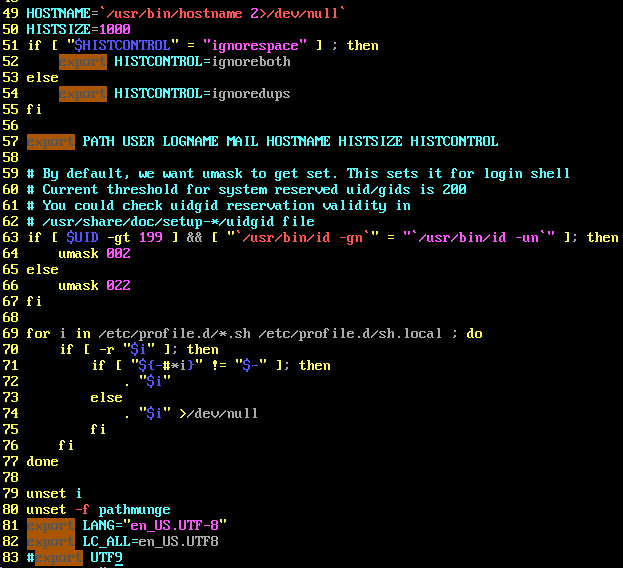

<center>Linux中一些坑，和小知识点</center>
> 为了方便和整洁，我把一些学习Linux中遇到的坑和小知识点写在这里


#### 1.	su,su -，sudo,su -c


##### su 和 su- 的区别

先简单说说前两者的区别：

​		前两者，其实都还应该加一个`su -p`，不过`su -p`和`su`都差不多这里就不说了。

​		首先得说`su`和`su -`是不一样的，虽然都是切换当前操作用户的命令，但是`su`切换的不干净，`su -`切换的彻底一些。至于为什么可以使用以下命令查看。

```
[jack@localhost ~]$ su root
passwd:
[root@localhost ~]# env | grep jack			
USER=jack						//使用上面的命令，查看环境变量中
MAIL=/var/spool/mail/jack			//关于上一次瀛湖jack的环境变量
PWD=/home/jack
HOEM=/home/jack					
…………等等				
```

> 以上中，可以看到su命令，环境变量没切换过来


##### sudo 

> 其实简单说就是，使普通用户不使用root账户，暂时的能执行root用户的一些权限。
>
> 前提是需要配置`/etc/sudoers`文件，还需要输入用户密码才得行，不过也可以设置不需要密码

基本格式如下：

```
[jack@localhost ~]$ sudo [-b] [-u 新使用者账号] [其他命令]	
```

简单示例：

```
[jack@localhost ~]$ sudo less /etc/shadow			//查看影子文件
```


注意！：

不过需要配置`/etc/sudoers`文件，普通用户才能使用`sudo`命令。


详细配置：[XXXX is not in the sudoers file. This incident will be reported解决方法](https://blog.csdn.net/csdnXiaoZou/article/details/89168015)

[sudo命令的具体内容](http://c.biancheng.net/view/877.html)


##### su -c

> 此处只会简单的讲一下su -c [选项]命令

简单说`su -c`命令，就是暂时的切换到目标用户，执行以下命令就切换回来。(很像sudo)


基本格式：

```
[jack@localhost ~]$ su -c [选项] 目标用户							
```


简单实例：

```
[jack@localhost ~]$ su -c "less -Nm /etc/shadow" root
				//简单的切换到root用户，查看shadow文件，然后切换回来
					//切换过程中需要输入密码
```


#### 2.	设置中文或英文时候的乱码

> 在设置中文，和英文的过程中遇到了不少的问题，听我慢慢道来

##### 主要设置编码格式的文件

```
/etc/profile			//设置编码格式和字符集的。最主要的东西
/etc/sysconfig/i18n		//这个文件我没有找到，所以一直调试的上面的文件
```


##### 主要涉及到的环境变量

> 此处使用环境变量更多的是用来调试，观察设置的对不对。

```
$LANG			//language 的简称，也是系统语言的环境变量
locale			//关于所有设置的语言选项
```


`/etc/profile`的文件具体内容如下：



> 此处我只截取一部分，需要用到的在最下面那几行。本来80行往下是没有的。

此文件可以手动的设定语系`LANG`，和字符集`LC_ALL`

> 对了，修改了`/etc/profile`文件后需要使用`source /etc/profile`保存一下


而使用`locale`命令的话，看到的为设置的所有：语系和字符集的结果。示例如下

```
[root@localhost ~]# locale
LANG=en_US.UTF-8 
LC_CTYPE="en_US.UTF-8"       #语言符号及其分类
LC_NUMERIC="en_US.UTF-8"     #数字
LC_TIME="en_US.UTF-8"        #时间显示格式
LC_COLLATE="en_US.UTF-8"     #比较和排序习惯
LC_MONETARY="en_US.UTF-8"    #货币单位
LC_MESSAGES="en_US.UTF-8"    #信息主要是提示信息,错误信息,状态信息,标题,标签,按钮和菜单等
LC_PAPER="en_US.UTF-8"       #默认纸张尺寸大小
LC_NAME="en_US.UTF-8"        #姓名书写方式
LC_ADDRESS="en_US.UTF-8"     #地址书写方式
LC_TELEPHONE="en_US.UTF-8"   #电话号码书写方式
LC_MEASUREMENT="en_US.UTF-8"     #度量衡表达方式 
LC_IDENTIFICATION="en_US.UTF-8"  #对locale自身包含信息的概述
LC_ALL=en_US.UTF-8 
```


只有当语系和字符集一一对应的时候，才能正确的设置系统语言。如果不对应的话，出来的会是英文乱码。


#### 3.	导入导出数据库


##### windows

> windows导出数据库

直接在Mysql目录下的`bin`目录下执行以下命令(此处才能用`mysqldump`)。

```
mysqldump -u root -p 源数据库 > 目标数据库
```


#### 4.	Linux

> Linux命令管道符


linux多命令

`; `多个命令互相不影响

`a && b` a命令执行成功才执行b命令

`a || b `a成功不执行b a失败执行b

 

`ifconfig && echo "成功" || echo “失败” `可用来判断第一个命令是否成功

 

 

管道命令`|`将第一个命令的执行结果给第二个命令

`netstate -an | grep ESTABLISHED | wc -l`


管道命令`&`前后的命令一起执行

```
ping 127.0.0.1 & ls
```

