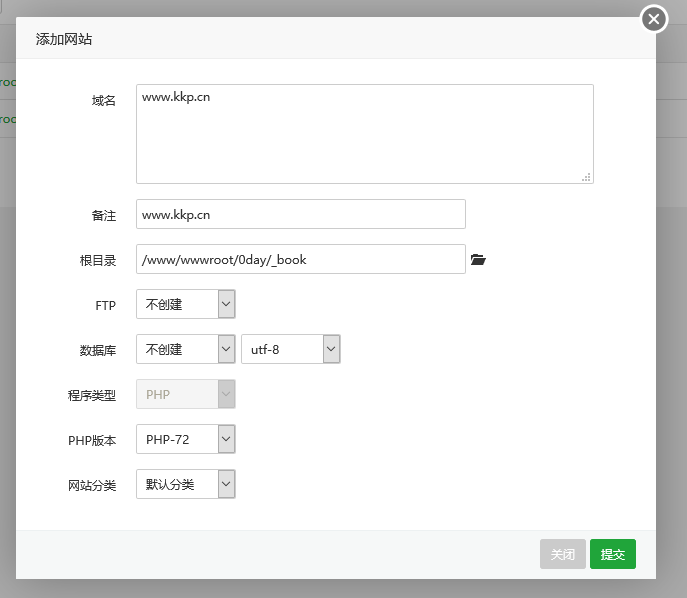
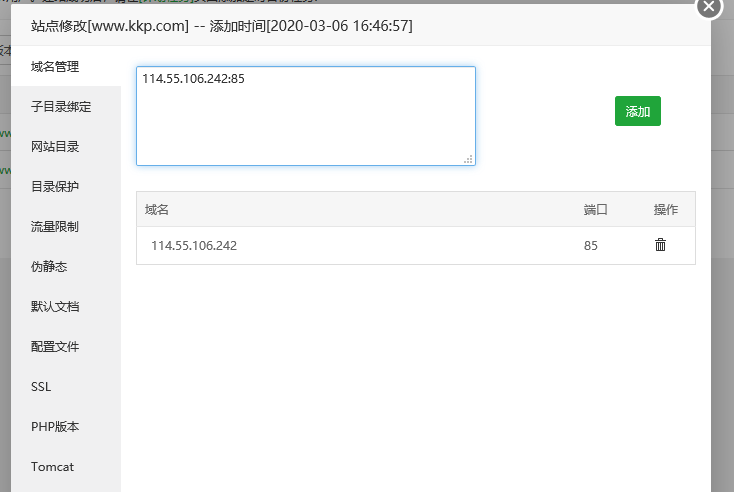
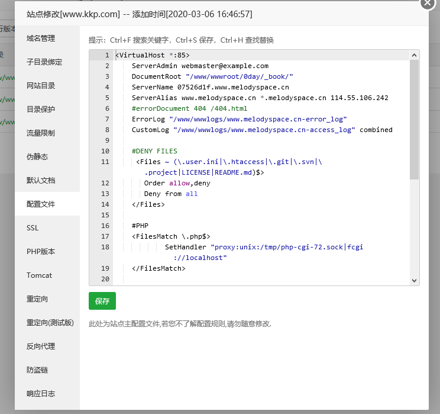

<center>搭建两个网站</center>


> 此章主要讲述：使用宝塔面板，在同一服务器中搭建两个网站


> 搭建网站的话，一定要在阿里云开放端口


1.使用宝塔面板新建站点。

​	使用宝塔面板新建站点，站点指向项目目录。


同时新建站点的时候，域名随便填写。




2.修改域名

在设置中的域名管理中，填入

```
本地ip:端口
```




> 此处采用的是85端口


3.修改配置文件


新站点配置文件的话，有可能是空的。所以就把其他正确站点的配置文件copy一份填进去，再做适当修改就好了



> 此处是以及修改过了的。


4. 重启配置

这个就没什么好说的了。在首页的apache中重启一下，或者重启配置都可以


