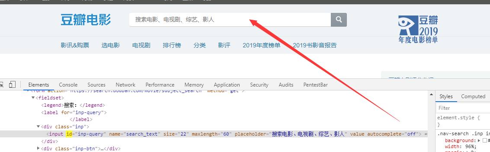
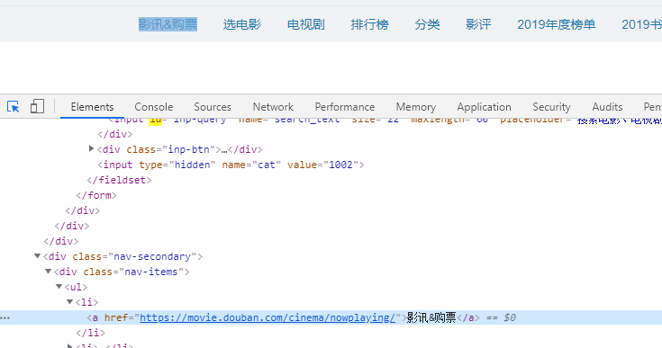

<center>Selenium笔记</center>

> 此章主要简单讲述Selenium自动化测试工具


#### 1.安装

此处通过pip来安装selenium。

```
pip install selenium
```


安装好了selenium后，继续安装Webdriver(chrome版本)

找到当前chrome浏览器的版本。然后去以下网址下载对应的Webdriver版本。

```
http://chromedriver.storage.googleapis.com/index.html
```


下载好了webdriver后把他放在python的安装目录中

> 也就是和python的解释器在同一目录下


然后写一个脚本来测试Webdriver和selenium是否可用

```
from selenium inport webdriver

web = webdriver.Chrome()
url = 'htpp://www.baidu.com'
web.get(url)
```

> 正常的话，运行脚本。就会启动Webdriver，请求百度首页。


#### 2.	元素定位


selenium有八种元素定位的方式

+ `find_element_by_id()`：通过id来定位元素
+ `find_element_by_name()`：通过name来定位元素


+ `find_element_by_class_name()`：通过class属性来定位
+ `find_element_by_tag_name()`：通过html标签来定位元素


+ `find_element_by_link_text()`：通过标签值来实现定位，也就是标签里面实际的文本来定位
+ `find_element_by_partial_link_text()`：通过标签值来实现模糊定位


+ `find_element_by_css_selector()`：通过css选择器来实现定位
+ `find_element_by_xpath_()`：通过xpath来实现定位


当然上面的所有函数都只是获取单个元素。如果像获取多个的话。elements就行了。例如：

```
web.find_elements_by_id()
```


---

此处只演示通过`id`和`link_text`和`css_selector`实现定位的过程


例如豆瓣电影首页中




##### 此处就可以通过id来实现定位：

```
web.find_element_by_id('inp-query').send_keys('阿凡达')
```

> 此处的web,是前面实例化的Webdriver对象。后面的函数是相当于键盘输入值。获取此元素并键盘输入`阿凡达`


##### 通过link_text实现定位

> 注意此处的input框不能进行link_text定位。因为其中的文字是他的属性值，不是他的标签值



```
web.find_element_by_link_text('影讯&购票').text
```

> 此处的a标签就可以通过`link_text`来定位，后面的text是获取其元素的文本值

`find_element_by_partial_link_text`也是差不多的用法，不过此为模糊匹配。而`link_text`为精准匹配。差别有一点。


##### 通过css_selector定位

> 此处为我最喜欢的css选择器来定位，倒不是因为其有多牛皮。主要是简单好用


同样是定位上面的`影讯&购票`。此处使用css选择器来定位一下

```
web.find_elment_by_css_selector('#db-nav-movie > div.nav-secondary > div > ul > li:nth-child(1) > a').click()
```

> 后面的`click()`是一个触发的函数。获取此元素。并触发click事件。相当于点一下。

我最喜欢css选择器的原因就是：你只需要在F12的element里面，找到你要定位的对应标签，直接右键-->copy-->copy selector。就可以直接的复制到css选择器的定位地址了。然后填进去就好了。

> 当然`xpath`也是差不多同样的用法。


#### 3.	网页元素操作

到了此处的话，其实都可以下一个简单的脚本了。这里附上我写的一个脚本。在`小配置`-->selenium脚本-->`selenium_test1.py`中


以下是一些实际开发中常见的操作方式

```
#清空x标签的内容
web.find_element_by_id('x').clear()
#获取元素在网页中的坐标位置，坐标格式为{'y':19,'x':498}
web.find_element_by_id('x').location()
#获取元素的某个属性值
web.find_element_by_id('x').get_attribute('href')
#判断网页在元素上是否可见,返回值为true或false
web.find_element_by_id('x').is_dispalyed()
#判断元素是选中，通常用于checkbox和radio标签，返回值为true或false。其他类型的话可能不管用。比如说写的只是长得像单选框的下拉菜单什么的。
web.find_element_by_id('x')is_selected()
```


---

以上是元素的常规操作办法。此处开始讲鼠标事件操作方法。鼠标的事件操作由`Selenium`的`ActionChains`类来实现。`ActionChains`类定义了多种鼠标操作方法。具体如下表


> 此处本来应该写ActionChain类的实际函数方法。但是突然不想写了。于是乎，等哪天有时间了后。再来继续写