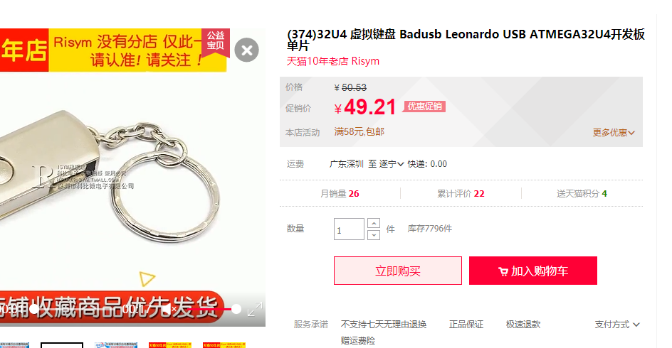
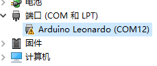
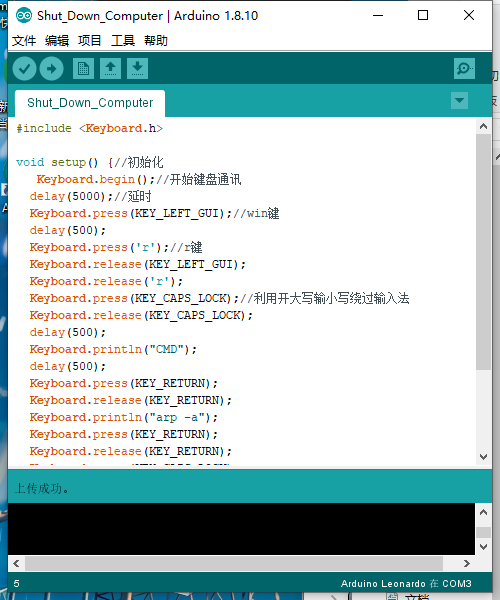

BadUsb初次

第一次使用badusb，遇到了不少的问题，不过还好，都一一解决掉了

在此做个笔记记录一下我踩的坑

##### 1.在网上买了个BadUsb，他的标题如下

这里我们抓住关键词`leonardo`，后面cmd

型号看一下就行了

##### 2.	下载驱动

接下来我买到了这款`BadUsb`

尝试插入，发现一点没反应都没有(我室友的就不用更新)。这时候我下载驱动人生，把所有的驱动都更新了一遍。

其中最重要的驱动是：通信控制器驱动。如下：

​	更新了此驱动了后，我们的通信端口就可以正常的开启。也就可以正确的对接`BadUsb`，

##### 3.	查看设备管理器

此时把BadUsb插入后，在**设备管理器**里会弹出一个端口选项，里面有一个`BadUsb`设备的标识(默认是，甚至端口那一栏都没有的)。

如下：

(ps.正常的话是没有黄色感叹号的，不过不用管他，只要插入后其中有选项是没带黄色感叹号的就行了，而且名字不是COM加数字就行了)

##### 4.	下载`Arduino`

此软件为专门给硬件编程使用的，其界面如下：

 此时已经插入了`BadUsb`

在此期间，如果`BadUsb`不能正常工作的话端口那一栏就是灰色的(ps.检查驱动)

##### 5.	Airduino配置

在上面的选项栏选择-->工具-->开发板-->Arduino leonardo

(因为我们牌子就选的`leonardo`)

然后-->编程工具-->`Airduino  Gemma`

界面如下：

##### 6.	结束

此时大致的就配好了，在上面的窗口里面下入代码，然后选择第二个箭头符号选择上传，再等个几十秒显示上传成功就好了

注意要更具`BadUsb`的型号来选择开发板,编程器的话就不那么严格

##### 7.	错误

**注意**：

+ 开发板选择错误的话可能导致不可写入
+ 注意驱动是否更新到最新，如果插上`BadUsb`根本没反应的话，就得考虑是否驱动问题了
+ 如果有时候写入过程中在上传的时候反复的无效，有效，(就像是反复插拔一样)，的话不用虚，继续写入就好了(有可能会报错开发板为Null)，多尝试几次还是那样的话，就的考虑开发板是否选择错误，和驱动是否有问题了