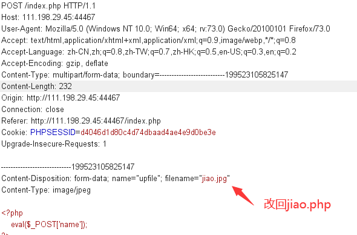
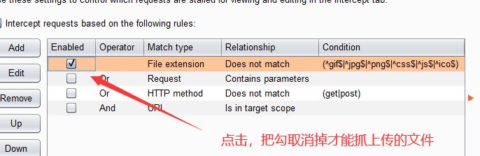

<center>文件上传漏洞</center>

#### 1.	JS绕过

> 上传的为一句话木马

前端JS的绕过很简单。我们一般只需要在抓包的时候修改文件名就好了。

​	如下：




注意抓包`burp`要开启`File extension`




然后通过蚁剑连接图片链接就可以连上目标服务器了；


#### 2.	图片一句话

可以通过合成图片一句话，将图片和一句话木马合成为一张图片.

> 不过图片一句话的话，只能通过解析漏洞才能获取到连接的响应


新建一个空目录，里面放入图片`img.jpg`，和一句话木马脚本`kkp.php`

进入`shell`目录执行以下以下命令：

```
copy  img.jpg/b+kkp.php  kkp_img.jpg
```

+ `img.jpg`：为图片
+ `kkp.php`：为脚本
+ `kkp_img.jpg`：为图片一句话