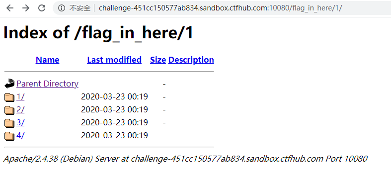

<center>web安全杂项</center>

> 此章简单讲述web安全杂项


#### 1.	robots.txt

> 有些网站的根目录下有`robots.txt`
>
> 此文件的作用是禁止百度等爬虫爬取网站中的一些页面

可以通过此文件看到网站中有哪些页面

```
http://111.198.29.45:43415/robots.txt
```


内容如下：

```
User-agent: *
Disallow: /fl0g.php


User-agent: Yandex
Disallow: *

//如果Disallow里面有这一行的话，则可以使用GitHack来获取其源码。
Disallow: /.git/
```


#### 2.	GitHack

当开发人员使用GIt进行版本控制，对站点自动部署不当，可能会将`.git`文件夹直接部署到线上环境。这就引起了`git`泄露漏洞。


**GitHack是一个.git泄露利用测试脚本，通过泄露的文件，还原重建工程源代码。**

Git信息泄露的危害很大，渗透测试人员、攻击者，可直接从源码获取敏感配置信息（如：邮箱，数据库），也可以进一步审计代码，挖掘文件上传、SQL注射等安全漏洞


Git工具的[下载地址](https://github.com/LanceaKing/GitHack3)。(注意这里的GitHack，必须在Git环境下才能使用，所以我这里用的是我的Linux)

> 此GitHack3。不是正版的GitHack，（正版的已停止更新，已不可使用）
>
> Git Hack是个脚本，不用安装。


简单使用教程：

如目标网站的`robots.txt`中显示有`/.git/`

```
目标网站
http://111.198.29.45:35854/

其robots.txt内容如下：
User-agent: *
Disallow: /.git/
```

> 可以看到，此处该网站把/.git/目录部署到了线上环境

此处我们就可以使用`GitHack`对目标进行攻击，以达到拿到其源码的目的


在`GitHack`目录中

```
[root@localhost GitHack-master]# ls
data  dist  GitHack.py  lib  LICENSE  README.md

[root@localhost GitHack-master]# python GitHack.py http://111.198.29.45:35854/.git/

……省略大量输出
[+] Clone Success. Dist File : /root/gitHack/GitHack-master/GitHack-master/dist/111.198.29.45_35854					//此处为下载的网站源码的地址
```

可以通过git获取目标源码，提交日志`git log`，临时工作区`git stash`获取信息


#### 3.	目录遍历




> 上图中，这种就叫做目录遍历


#### 4.	源码泄露


##### 备份文件下载

> 当开发人员在线上环境中对源代码进行了备份操作，并且将备份文件放在了 web 目录下，就会引起网站源码泄露。


常见的网站源码备份文件后缀

------

- tar
- tar.gz
- zip
- rar


常见的网站源码备份文件名

------

- web
- website
- backup
- back
- www
- wwwroot
- temp


例如，我做一道CTF题的时候。通过下载的备份文件源码。

`http://challenge-e76e2143c83583bd.sandbox.ctfhub.com:10080/www.zip`

通过域名后面的www.zip下载源码


##### bak

bak文件是windows下自动保存的文件

​	例如：

​		index.php会自动保存为`index.php.bak`

​		下载后，去掉后缀。再查看就好了


例如：CTF题中

​	`http://challenge-e76e2143c83583bd.sandbox.ctfhub.com:10080/index.php.bak`


##### vim编辑器缓存

用vim编辑文件时，如果文件没有正常的关闭（wq、q、q!），那么就会生成一个崩溃缓存文件


崩溃缓存文件的和作用

> - ①. 缓存文件是隐藏文件
> - ②. 缓存文件基本格式是 .file.swp （默认在原目录中）
> - ③. 缓存文件的作用是用于在系统意外关机的情况下，恢复文件中的内容（修改了文件内容，意外关掉终端或者系统）
> - ④. 缓存文件的使用方式
> - 第一步：# vim -r .file.swp
> - 第二步：保存退出
> - 第三步：删除缓存文件


此处的`.file.swp`中的file为文件名。

​	例如：CTF题中

​		vim缓存文件为

​     `http://challenge-35cc52c65df0037e.sandbox.ctfhub.com:10080/.index.php.swp`

​		直接通过此连接就可以下载文件了


此文件可以用vim通过`vim -r .file.swp`打开。


##### DS_Store

.DS_Store 是 Mac OS 保存文件夹的自定义属性的隐藏文件。通过.DS_Store可以知道这个目录里面所有文件的清单。


​	例如：CTF中

`http://challenge-a377ce1ddf1fc66b.sandbox.ctfhub.com:10080/.DS_Store`


这样就可以下载DS_Store文件。这样就可以下载DS_Store文件，通过此文件可以查看当前目录下所有文件的清单。


##### git 泄露

此处就不说git泄露了，此文章上面有